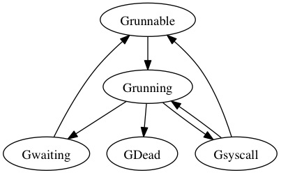

golang 基础  
##基础  
##List/Slice  
###操作    
```
// 初始化方式1：直接声明
var slice1 []int
// 初始化方式2：使用字面量
slice2 := []int{1, 2, 3, 4}
// 初始化方式3：使用make创建slice
slice3 := make([]int, 3, 5)
// 初始化方式4: 从切片或数组“截取”
slcie4 := arr[1:3]
```
###原理      
切片是基于数组实现的，它的底层是数组，可以理解为对 底层数组的抽象。
源码包中src/runtime/slice.go 定义了slice的数据结构：
```
type slice struct {
    array unsafe.Pointer
    len   int
    cap   int
}
```
slice占用24个字节
array: 指向底层数组的指针，占用8个字节
len: 切片的长度，占用8个字节
cap: 切片的容量，cap 总是大于等于 len 的，占用8个字节
slice有4种初始化方式  

其他      
```
0x0042 00066 (test.go:6)        CALL    runtime.makeslice(SB)
0x006d 00109 (test.go:7)        CALL    runtime.growslice(SB)
0x00a4 00164 (test.go:8)        CALL    runtime.convTslice(SB)
0x00c0 00192 (test.go:8)        CALL    runtime.convT64(SB)
0x00d8 00216 (test.go:8)        CALL    runtime.convT64(SB)
0x0166 00358 ($GOROOT/src/fmt/print.go:274)     CALL    fmt.Fprintln(SB)
0x0180 00384 (test.go:5)        CALL    runtime.morestack_noctxt(SB)
0x0079 00121 (<autogenerated>:1)        CALL    runtime.efaceeq(SB)
0x00a0 00160 (<autogenerated>:1)        CALL    runtime.morestack_noctxt(SB)
```
初始化slice调用的是runtime.makeslice，makeslice函数的工作主要就是计算slice所需内存大小，然后调用mallocgc进行内存的分配
所需内存大小 = 切片中元素大小 * 切片的容量

slice 和list 区分
1.长度不同 list 指定长度无法扩容;slice不指定可扩容
2.创建命令不同
    数组值类型 复制数组为深拷贝，会额外占用内存
    切片为指针类型 函数传参不会占用新内容，修改会变
3.计算长度不同
    数组计算长度 on
    切片计算长度 o1 // 结构体中存在长度


###深拷贝浅拷贝
深拷贝：拷贝的是数据本身，创造一个新对象，新创建的对象与原对象不共享内存，新创建的对象在内存中开辟一个新的内存地址，新对象值修改时不会影响原对象值
实现深拷贝的方式：
copy(slice2, slice1)
遍历append赋值
```
func main() {
    slice1 := []int{1, 2, 3, 4, 5}
    slice2 := make([]int, 5, 5)
    fmt.Printf("slice1: %v, %p\n", slice1, slice1)
    copy(slice2, slice1)
    fmt.Printf("slice2: %v, %p\n", slice2, slice2)
    slice3 := make([]int, 0, 5)
    for _, v := range slice1 {
        slice3 = append(slice3, v)
    }
    fmt.Printf("slice3: %v, %p\n", slice3, slice3)
}

slice1: [1 2 3 4 5], 0xc0000b0030
slice2: [1 2 3 4 5], 0xc0000b0060
slice3: [1 2 3 4 5], 0xc0000b0090
```

###扩容  
扩容会发生在slice append的时候，当slice的cap不足以容纳新元素，就会进行扩容，扩容规则如下

如果新申请容量比两倍原有容量大，那么扩容后容量大小 为 新申请容量
如果原有 slice 长度小于 1024， 那么每次就扩容为原来的 2 倍
如果原 slice 长度大于等于 1024， 那么每次扩容就扩为原来的 1.25 倍

关于线程不安全  
先看下线程安全的定义：
多个线程访问同一个对象时，调用这个对象的行为都可以获得正确的结果，
那么这个对象就是线程安全的。 若有多个线程同时执行写操作，一般都需要考虑线程同步，否则的话就可能影响线程安全。
再看Go语言实现线程安全常用的几种方式：

###互斥锁  
读写锁  
原子操作  
sync.once  
sync.atomic  
channel  
slice底层结构并没有使用加锁等方式，  
不支持并发读写，所以并不是线程安全的，
使用多个 goroutine 对类型为 slice 的变量进行操作， 每次输出的值大概率都不会一样，
与预期值不一致; slice在并发执行中不会报错，但是数据会丢失

##Map  
  
###原理  
Go中的map是一个指针，占用8个字节，指向hmap结构体
源码包中src/runtime/map.go定义了hmap的数据结构：
hmap包含若干个结构为bmap的数组，每个bmap底层都采用链表结构，bmap通常叫其bucket

bmap 就是我们常说的“桶”，一个桶里面会最多装 8 个 key，这些 key 之所以会落入同一个桶，是因为它们经过哈希计算后，哈希结果的低B位是相同的，关于key的定位我们在map的查询中详细说明。
在桶内，又会根据 key 计算出来的 hash 值的高 8 位来决定 key 到底落入桶内的哪个位置（一个桶内最多有8个位置)。
```
// A header for a Go map.
type hmap struct {
    count     int 
    // 代表哈希表中的元素个数，调用len(map)时，返回的就是该字段值。
    flags     uint8 
    // 状态标志（是否处于正在写入的状态等）
    B         uint8  
    // buckets（桶）的对数
    // 如果B=5，则buckets数组的长度 = 2^B=32，意味着有32个桶
    noverflow uint16 
    // 溢出桶的数量
    hash0     uint32 
    // 生成hash的随机数种子
    buckets    unsafe.Pointer 
    // 指向buckets数组的指针，数组大小为2^B，如果元素个数为0，它为nil。
    oldbuckets unsafe.Pointer 
    // 如果发生扩容，oldbuckets是指向老的buckets数组的指针，老的buckets数组大小是新的buckets的1/2;非扩容状态下，它为nil。
    nevacuate  uintptr        
    // 表示扩容进度，小于此地址的buckets代表已搬迁完成。
    extra *mapextra 
    // 存储溢出桶，这个字段是为了优化GC扫描而设计的，下面详细介绍
 }

// A bucket for a Go map.
type bmap struct {
tophash [bucketCnt]uint8
// len为8的数组
// 用来快速定位key是否在这个bmap中
// 一个桶最多8个槽位，如果key所在的tophash值在tophash中，则代表该key在这个桶中
}
```
###map 的无序  
map在遍历时，并不是从固定的0号bucket开始遍历的，每次遍历，都会从一个随机值序号的bucket，再从其中随机的cell开始遍历  
map遍历时，是按序遍历bucket，同时按需遍历bucket中和其overflow bucket中的cell。但是map在扩容后，会发生key的搬迁，这造成原来落在一个bucket中的key，搬迁后，有可能会落到其他bucket中了，从这个角度看，遍历map的结果就不可能是按照原来的顺序了

###非线程安全  
map默认是并发不安全的，同时对map进行并发读写时，程序会panic，原因如下：  
Go 官方在经过了长时间的讨论后，认为 Go map 更应适配典型使用场景（不需要从多个 goroutine 中进行安全访问），而不是为了小部分情况（并发访问），导致大部分程序付出加锁代价（性能），决定了不支持。  
场景: 2个协程同时读和写，以下程序会出现致命错误：fatal error: concurrent map writes  

如果想实现map线程安全，有两种方式：

方式一：使用读写锁 map + sync.RWMutex
```
package main

import (
    "fmt"
    "sync"
    "time"
)

func main() {
    var lock sync.RWMutex
    s := make(map[int]int)
    for i := 0; i < 100; i++ {
        go func(i int) {
            lock.Lock()
            s[i] = i
            lock.Unlock()
        }(i)
    }
    for i := 0; i < 100; i++ {
        go func(i int) {
            lock.RLock()
            fmt.Printf("map第%d个元素值是%d\n", i, s[i])
            lock.RUnlock()
        }(i)
    }
    time.Sleep(1 * time.Second)
}
```

方式二：使用Go提供的 sync.Map
```
package main

import (
    "fmt"
    "sync"
    "time"
)

func main() {
    var m sync.Map
    for i := 0; i < 100; i++ {
        go func(i int) {
            m.Store(i, i)
        }(i)
    }
    for i := 0; i < 100; i++ {
        go func(i int) {
            v, ok := m.Load(i)
            fmt.Printf("Load: %v, %v\n", v, ok)
        }(i)
    }
    time.Sleep(1 * time.Second)
}
```

map 查找
Go 语言中读取 map 有两种语法：带 comma 和 不带 comma。当要查询的 key 不在 map 里，带 comma 的用法会返回一个 bool 型变量提示 key 是否在 map 中；而不带 comma 的语句则会返回一个 value 类型的零值。
如果 value 是 int 型就会返回 0，如果 value 是 string 类型，就会返回空字符串
```
// 不带 comma 用法
value := m["name"]
fmt.Printf("value:%s", value)

// 带 comma 用法
value, ok := m["name"]
if ok {
    fmt.Printf("value:%s", value)
}
```

写保护监测
函数首先会检查 map 的标志位 flags。如果 flags 的写标志位此时被置 1 了，说明有其他协程在执行“写”操作，进而导致程序 panic，这也说明了 map 不是线程安全的
```
if h.flags&hashWriting != 0 {
throw("concurrent map read and map write")
}
```

计算hash值
```
hash := t.hasher(key, uintptr(h.hash0))
```
key经过哈希函数计算后，得到的哈希值如下（主流64位机下共 64 个 bit 位）， 不同类型的key会有不同的hash函数

```
10010111 | 000011110110110010001111001010100010010110010101010 │ 01010
```
找到hash对应的bucket
bucket定位：哈希值的低B个bit 位，用来定位key所存放的bucket
如果当前正在扩容中，并且定位到的旧bucket数据还未完成迁移，则使用旧的bucket（扩容前的bucket）

``` 
hash := t.hasher(key, uintptr(h.hash0))
// 桶的个数m-1，即 1<<B-1,B=5时，则有0~31号桶
m := bucketMask(h.B)
// 计算哈希值对应的bucket
// t.bucketsize为一个bmap的大小，通过对哈希值和桶个数取模得到桶编号，通过对桶编号和buckets起始地址进行运算，获取哈希值对应的bucket
b := (*bmap)(add(h.buckets, (hash&m)*uintptr(t.bucketsize)))
// 是否在扩容
if c := h.oldbuckets; c != nil {
// 桶个数已经发生增长一倍，则旧bucket的桶个数为当前桶个数的一半
if !h.sameSizeGrow() {
// There used to be half as many buckets; mask down one more power of two.
m >>= 1
}
// 计算哈希值对应的旧bucket
oldb := (*bmap)(add(c, (hash&m)*uintptr(t.bucketsize)))
// 如果旧bucket的数据没有完成迁移，则使用旧bucket查找
if !evacuated(oldb) {
b = oldb
}
}
```
4. 遍历bucket查找  
tophash值定位：哈希值的高8个bit 位，用来快速判断key是否已在当前bucket中（如果不在的话，需要去bucket的overflow中查找）
用步骤2中的hash值，得到高8个bit位，也就是10010111，转化为十进制，也就是151
``` 
 top := tophash(hash)
func tophash(hash uintptr) uint8 {
top := uint8(hash >> (goarch.PtrSize*8 - 8))
if top < minTopHash {
top += minTopHash
}
return top
}
```

上面函数中hash是64位的，sys.PtrSize值是8，所以top := uint8(hash >> (sys.PtrSize*8 - 8))等效top = uint8(hash >> 56)，最后top取出来的值就是hash的高8位值

在 bucket 及bucket的overflow中寻找tophash 值（HOB hash）为 151* 的 槽位，即为key所在位置，找到了空槽位或者 2 号槽位，这样整个查找过程就结束了，其中找到空槽位代表没找到。

``` 
for ; b != nil; b = b.overflow(t) {
        for i := uintptr(0); i < bucketCnt; i++ {
            if b.tophash[i] != top {
              // 未被使用的槽位，插入
                if b.tophash[i] == emptyRest {
                    break bucketloop
                }
                continue
            }
            // 找到tophash值对应的的key
            k := add(unsafe.Pointer(b), dataOffset+i*uintptr(t.keysize))
            if t.key.equal(key, k) {
                e := add(unsafe.Pointer(b), dataOffset+bucketCnt*uintptr(t.keysize)+i*uintptr(t.elemsize))
                return e
            }
        }
    }

```
5. 返回key对应的指针
```
// keys的偏移量
dataOffset = unsafe.Offsetof(struct{
  b bmap
  v int64
}{}.v)

// 一个bucket的元素个数
bucketCnt = 8

// key 定位公式
k :=add(unsafe.Pointer(b),dataOffset+i*uintptr(t.keysize))

// value 定位公式
v:= add(unsafe.Pointer(b),dataOffset+bucketCnt*uintptr(t.keysize)+i*uintptr(t.valuesize))

```


###冲突解决方式  
比较常用的Hash冲突解决方案有链地址法和开放寻址法：

链地址法  

当哈希冲突发生时，创建新单元，并将新单元添加到冲突单元所在链表的尾部。  

开放寻址法  

当哈希冲突发生时，从发生冲突的那个单元起，按照一定的次序，从哈希表中寻找一个空闲的单元，然后把发生冲突的元素存入到该单元。开放寻址法需要的表长度要大于等于所需要存放的元素数量
开放寻址法有多种方式：线性探测法、平方探测法、随机探测法和双重哈希法。这里以线性探测法来帮助读者理解开放寻址法思想

线性探测法  

设 Hash(key) 表示关键字 key 的哈希值， 表示哈希表的槽位数（哈希表的大小）。

线性探测法则可以表示为：  
如果 Hash(x) % M 已经有数据，则尝试 (Hash(x) + 1) % M ;  
如果 (Hash(x) + 1) % M 也有数据了，则尝试 (Hash(x) + 2) % M ;  
如果 (Hash(x) + 2) % M 也有数据了，则尝试 (Hash(x) + 3) % M ;  

两种解决方案比较

对于链地址法，基于数组 + 链表进行存储，链表节点可以在需要时再创建，不必像开放寻址法那样事先申请好足够内存，因此链地址法对于内存的利用率会比开方寻址法高。链地址法对装载因子的容忍度会更高，并且适合存储大对象、大数据量的哈希表。而且相较于开放寻址法，它更加灵活，支持更多的优化策略，比如可采用红黑树代替链表。但是链地址法需要额外的空间来存储指针。

对于开放寻址法，它只有数组一种数据结构就可完成存储，继承了数组的优点，对CPU缓存友好，易于序列化操作。但是它对内存的利用率不如链地址法，且发生冲突时代价更高。当数据量明确、装载因子小，适合采用开放寻址法。

总结
在发生哈希冲突时，Python中dict采用的开放寻址法，Java的HashMap采用的是链地址法，而Go map也采用链地址法解决冲突，具体就是插入key到map中时，当key定位的桶填满8个元素后（这里的单元就是桶，不是元素），将会创建一个溢出桶，并且将溢出桶插入当前桶所在链表尾部。
```
if inserti == nil {
        // all current buckets are full, allocate a new one.
        newb := h.newoverflow(t, b)
        // 创建一个新的溢出桶
        inserti = &newb.tophash[0]
        insertk = add(unsafe.Pointer(newb), dataOffset)
        elem = add(insertk, bucketCnt*uintptr(t.keysize))
}

```


负载因子
什么是负载因子?

负载因子（load factor），用于衡量当前哈希表中空间占用率的核心指标，也就是每个 bucket 桶存储的平均元素个数。

```
负载因子 = 哈希表存储的元素个数/桶个数
```

另外负载因子与扩容、迁移等重新散列（rehash）行为有直接关系：

在程序运行时，会不断地进行插入、删除等，会导致 bucket 不均，内存利用率低，需要迁移。
在程序运行时，出现负载因子过大，需要做扩容，解决 bucket 过大的问题。
负载因子是哈希表中的一个重要指标，在各种版本的哈希表实现中都有类似的东西，主要目的是为了平衡 buckets 的存储空间大小和查找元素时的性能高低。

在接触各种哈希表时都可以关注一下，做不同的对比，看看各家的考量。


扩容
扩容时机：

在向 map 插入新 key 的时候，会进行条件检测，符合下面这 2 个条件，就会触发扩容

```
if !h.growing() && (overLoadFactor(h.count+1, h.B) || 
tooManyOverflowBuckets(h.noverflow, h.B)) {
    hashGrow(t, h)
        goto again // Growing the table invalidates everything, so try again
}
```

// 判断是否在扩容
```
func (h *hmap) growing() bool {
    return h.oldbuckets != nil
}

```
扩容条件：

条件1：超过负载

map元素个数 > 6.5 * 桶个数

```
func overLoadFactor(count int, B uint8) bool {
return count > bucketCnt && uintptr(count) > loadFactor*bucketShift(B)
}

其中

bucketCnt = 8，一个桶可以装的最大元素个数
loadFactor = 6.5，负载因子，平均每个桶的元素个数
bucketShift(B): 桶的个数
```
条件2：溢出桶太多

当桶总数 < 2 ^ 15 时，如果溢出桶总数 >= 桶总数，则认为溢出桶过多。

当桶总数 >= 2 ^ 15 时，直接与 2 ^ 15 比较，当溢出桶总数 >= 2 ^ 15 时，即认为溢出桶太多了。

```
func tooManyOverflowBuckets(noverflow uint16, B uint8) bool {
// If the threshold is too low, we do extraneous work.
// If the threshold is too high, maps that grow and shrink can hold on to lots of unused memory.
// "too many" means (approximately) as many overflow buckets as regular buckets.
// See incrnoverflow for more details.
if B > 15 {
B = 15
}
// The compiler doesn't see here that B < 16; mask B to generate shorter shift code.
    return noverflow >= uint16(1)<<(B&15)
}
```
对于条件2，其实算是对条件1的补充。因为在负载因子比较小的情况下，有可能 map 的查找和插入效率也很低，而第 1 点识别不出来这种情况。

表面现象就是负载因子比较小比较小，即 map 里元素总数少，但是桶数量多（真实分配的桶数量多，包括大量的溢出桶）。比如不断的增删，这样会造成overflow的bucket数量增多，但负载因子又不高，达不到第 1 点的临界值，就不能触发扩容来缓解这种情况。这样会造成桶的使用率不高，值存储得比较稀疏，查找插入效率会变得非常低，因此有了第 2 扩容条件。

扩容机制：

双倍扩容：针对条件1，新建一个buckets数组，新的buckets大小是原来的2倍，然后旧buckets数据搬迁到新的buckets。该方法我们称之为双倍扩容

等量扩容：针对条件2，并不扩大容量，buckets数量维持不变，重新做一遍类似双倍扩容的搬迁动作，把松散的键值对重新排列一次，使得同一个 bucket 中的 key 排列地更紧密，节省空间，提高 bucket 利用率，进而保证更快的存取。该方法我们称之为等量扩容。

扩容函数：

上面说的 hashGrow() 函数实际上并没有真正地“搬迁”，它只是分配好了新的 buckets，并将老的 buckets 挂到了 oldbuckets 字段上。真正搬迁 buckets 的动作在 growWork() 函数中，而调用 growWork() 函数的动作是在 mapassign 和 mapdelete 函数中。也就是插入或修改、删除 key 的时候，都会尝试进行搬迁 buckets 的工作。先检查 oldbuckets 是否搬迁完毕，具体来说就是检查 oldbuckets 是否为 nil

```
1  func hashGrow(t *maptype, h *hmap) {
2  // 如果达到条件 1，那么将B值加1，相当于是原来的2倍
3  // 否则对应条件 2，进行等量扩容，所以 B 不变
4    bigger := uint8(1)
5    if !overLoadFactor(h.count+1, h.B) {
6        bigger = 0
7        h.flags |= sameSizeGrow
8    }
9  // 记录老的buckets
10    oldbuckets := h.buckets
11  // 申请新的buckets空间
12    newbuckets, nextOverflow := makeBucketArray(t, h.B+bigger, nil)
13  // 注意&^ 运算符，这块代码的逻辑是转移标志位
14    flags := h.flags &^ (iterator | oldIterator)
15    if h.flags&iterator != 0 {
16        flags |= oldIterator
17    }
18    // 提交grow (atomic wrt gc)
19    h.B += bigger
20    h.flags = flags
21    h.oldbuckets = oldbuckets
22    h.buckets = newbuckets
23  // 搬迁进度为0
24    h.nevacuate = 0
25  // overflow buckets 数为0
26    h.noverflow = 0
27
28  // 如果发现hmap是通过extra字段 来存储 overflow buckets时
29    if h.extra != nil && h.extra.overflow != nil {
30        if h.extra.oldoverflow != nil {
31            throw("oldoverflow is not nil")
32        }
33        h.extra.oldoverflow = h.extra.overflow
34        h.extra.overflow = nil
35    }
36    if nextOverflow != nil {
37        if h.extra == nil {
38            h.extra = new(mapextra)
39        }
40        h.extra.nextOverflow = nextOverflow
41    }
42}
```
由于 map 扩容需要将原有的 key/value 重新搬迁到新的内存地址，如果map存储了数以亿计的key-value，一次性搬迁将会造成比较大的延时，因此 Go map 的扩容采取了一种称为**“渐进式”**的方式，原有的 key 并不会一次性搬迁完毕，每次最多只会搬迁 2 个 bucket。

```
func growWork(t *maptype, h *hmap, bucket uintptr) {
    // 为了确认搬迁的 bucket 是我们正在使用的 bucket
    // 即如果当前key映射到老的bucket1，那么就搬迁该bucket1。
    evacuate(t, h, bucket&h.oldbucketmask())
    // 如果还未完成扩容工作，则再搬迁一个bucket。
    if h.growing() {
        evacuate(t, h, h.nevacuate)
    }
}
```

其他  


#Channel
channel有2种类型：无缓冲、有缓冲

channel有3种模式：写操作模式（单向通道）、读操作模式（单向通道）、读写操作模式（双向通道）

写操作模式	读操作模式	读写操作模式
创建	make(chan<- int)	make(<-chan int)	make(chan int)
channel有3种状态：未初始化、正常、关闭

```
       未初始化	         关闭	                         正常
关闭	    panic	         panic	                        正常关闭
发送	永远阻塞导致死锁	     panic	                        阻塞或者成功发送
接收	永远阻塞导致死锁	     缓冲区为空则为零值, 否则可以继续读	阻塞或者成功接收
```
注意点：

一个 channel不能多次关闭，会导致painc
如果多个 goroutine 都监听同一个 channel，那么 channel 上的数据都可能随机被某一个 goroutine 取走进行消费
如果多个 goroutine 监听同一个 channel，如果这个 channel 被关闭，则所有 goroutine 都能收到退出信号

##操作：

###创建
使用 make(chan T, cap) 来创建 channel，make 语法会在编译时，
转换为 makechan64 和 makechan
```
func makechan64(t *chantype, size int64) *hchan {
    if int64(int(size)) != size {
        panic(plainError("makechan: size out of range"))
    }
    return makechan(t, int(size))
}
```
创建channel 有两种，一种是带缓冲的channel，一种是不带缓冲的channel

``` 
// 带缓冲
ch := make(chan int, 3)
// 不带缓冲
ch := make(chan int)
```
创建时会做一些检查:
元素大小不能超过 64K  
元素的对齐大小不能超过 maxAlign 也就是 8 字节  
计算出来的内存是否超过限制  
创建时的策略:  

如果是无缓冲的 channel，会直接给 hchan 分配内存  
如果是有缓冲的 channel，并且元素不包含指针，那么会为 hchan 和底层数组分配一段连续的地址  
如果是有缓冲的 channel，并且元素包含指针，那么会为 hchan 和底层数组分别分配地址  

###发送

发送操作，编译时转换为runtime.chansend函数
```
func chansend(c *hchan, ep unsafe.Pointer, block bool, callerpc uintptr) bool
```
阻塞式：

调用chansend函数，并且block=true
```
ch <- 10
```
非阻塞式：

调用chansend函数，并且block=false
```
select {
case ch <- 10:
...

default
}
```
向 channel 中发送数据时大概分为两大块：检查和数据发送，数据发送流程如下：

如果 channel 的读等待队列存在接收者goroutine
将数据直接发送给第一个等待的 goroutine， 唤醒接收的 goroutine
如果 channel 的读等待队列不存在接收者goroutine
如果循环数组buf未满，那么将会把数据发送到循环数组buf的队尾
如果循环数组buf已满，这个时候就会走阻塞发送的流程，将当前 goroutine 加入写等待队列，并挂起等待唤醒


###接收

发送操作，编译时转换为runtime.chanrecv函数

func chanrecv(c *hchan, ep unsafe.Pointer, block bool) (selected, received bool)

阻塞式：

```
调用chanrecv函数，并且block=true

<ch

v := <ch

v, ok := <ch

```

当channel关闭时，for循环会自动退出，无需主动监测channel是否关闭，
可以防止读取已经关闭的channel,造成读到数据为通道所存储的数据类型的零值
```
for i := range ch {
    fmt.Println(i)
}
```

非阻塞式：

调用chanrecv函数，并且block=false
```
select {
    case <-ch:
    ...

  default
}
```


向 channel 中接收数据时大概分为两大块，检查和数据发送，而数据接收流程如下：

如果 channel 的写等待队列存在发送者goroutine  
如果是无缓冲 channel，直接从第一个发送者goroutine那里把数据拷贝给接收变量，唤醒发送的 goroutine  
如果是有缓冲 channel（已满），将循环数组buf的队首元素拷贝给接收变量，将第一个发送者goroutine的数据拷贝到 buf循环数组队尾，唤醒发送的 goroutine  
如果 channel 的写等待队列不存在发送者goroutine  
如果循环数组buf非空，将循环数组buf的队首元素拷贝给接收变量  
如果循环数组buf为空，这个时候就会走阻塞接收的流程，将当前 goroutine 加入读等待队列，并挂起等待唤醒  
关闭  

关闭操作，调用close函数，编译时转换为runtime.closechan函数

```
close(ch)

func closechan(c *hchan)
```

案例分析：

```
package main

import (
    "fmt"
    "time"
    "unsafe"
)

func main() {
// ch是长度为4的带缓冲的channel
// 初始hchan结构体重的buf为空，sendx和recvx均为0
    ch := make(chan string, 4)
    fmt.Println(ch, unsafe.Sizeof(ch))
    go sendTask(ch)
    go receiveTask(ch)
    time.Sleep(1 * time.Second)
}

// G1是发送者
// 当G1向ch里发送数据时，首先会对buf加锁，然后将task存储的数据copy到buf中，然后sendx++，然后释放对buf的锁
func sendTask(ch chan string) {
    taskList := []string{"this", "is", "a", "demo"}
    for _, task := range taskList {
        ch <- task //发送任务到channel
    }
}

// G2是接收者
// 当G2消费ch的时候，会首先对buf加锁，然后将buf中的数据copy到task变量对应的内存里，然后recvx++,并释放锁
func receiveTask(ch chan string) {
    for {
        task := <-ch                  //接收任务
        fmt.Println("received", task) //处理任务
    }`
}
```

总结hchan结构体的主要组成部分有四个：

用来保存goroutine之间传递数据的循环数组：buf  
用来记录此循环数组当前发送或接收数据的下标值：sendx和recvx  
用于保存向该chan发送和从该chan接收数据被阻塞的goroutine队列： sendq 和 recv  
保证channel写入和读取数据时线程安全的锁：lock  
###原理  
Go中的channel 是一个队列，遵循先进先出的原则，负责协程之间的通信（Go 语言提倡不要通过共享内存来通信，而要通过通信来实现内存共享，CSP(Communicating Sequential Process)并发模型，就是通过 goroutine 和 channel 来实现的）
  
```

type hchan struct {
 closed   uint32   // channel是否关闭的标志
 elemtype *_type   // channel中的元素类型
 
 // channel分为无缓冲和有缓冲两种。
 // 对于有缓冲的channel存储数据，使用了 ring buffer（环形缓冲区) 来缓存写入的数据，本质是循环数组
 // 为啥是循环数组？普通数组不行吗，普通数组容量固定更适合指定的空间，弹出元素时，普通数组需要全部都前移
 // 当下标超过数组容量后会回到第一个位置，所以需要有两个字段记录当前读和写的下标位置
 buf      unsafe.Pointer // 指向底层循环数组的指针（环形缓冲区）
 qcount   uint           // 循环数组中的元素数量
 dataqsiz uint           // 循环数组的长度
 sendx    uint           // 下一次写下标的位置
 recvx    uint           // 下一次读下标的位置
  
 // 尝试读取channel或向channel写入数据而被阻塞的goroutine
 recvq    waitq  // 读等待队列
 sendq    waitq  // 写等待队列

 lock mutex //互斥锁，保证读写channel时不存在并发竞争问题
}


type waitq struct {
    first *sudog
    last  *sudog
}
每个节点是一个sudog结构体变量，记录哪个协程在等待，等待的是哪个channel，等待发送/接收的数据在哪里
type sudog struct {
    g *g
    next *sudog
    prev *sudog
    elem unsafe.Pointer
    c        *hchan
...
}

```
使用场景  
```
停止信号监听

定时任务

生产方和消费方解耦

控制并发数

```
其他  

##Mutex
Go sync包提供了两种锁类型：互斥锁sync.Mutex 和 读写互斥锁sync.RWMutex，都属于悲观锁。  
注意  
在 Lock() 之前使用 Unlock() 会导致 panic 异常  
使用 Lock() 加锁后，再次 Lock() 会导致死锁（不支持重入），需Unlock()解锁后才能再加锁  
锁定状态与 goroutine 没有关联，一个 goroutine 可以 Lock，另一个 goroutine 可以 Unlock  

####概念
Mutex是互斥锁，当一个 goroutine 获得了锁后，
其他 goroutine 不能获取锁（只能存在一个写者或读者，不能同时读和写）
####使用场景
多个线程同时访问临界区，为保证数据的安全，锁住一些共享资源， 
以防止并发访问这些共享数据时可能导致的数据不一致问题。
获取锁的线程可以正常访问临界区，未获取到锁的线程等待锁释放后可以尝试获取锁


底层实现结构
互斥锁对应的是底层结构是sync.Mutex结构体，，位于 src/sync/mutex.go中
```
    type Mutex struct {  
    state int32  
    sema  uint32
}
```
state表示锁的状态，有锁定、被唤醒、饥饿模式等，并且是用state的二进制位来标识的，不同模式下会有不同的处理方式

sema表示信号量，mutex阻塞队列的定位是通过这个变量来实现的，从而实现goroutine的阻塞和唤醒

```
addr = &sema
func semroot(addr *uint32) *semaRoot {  
   return &semtable[(uintptr(unsafe.Pointer(addr))>>3)%semTabSize].root  
}
root := semroot(addr)
root.queue(addr, s, lifo)
root.dequeue(addr)

var semtable [251]struct {  
   root semaRoot  
   ...
}

type semaRoot struct {  
  lock  mutex  
  treap *sudog // root of balanced tree of unique waiters.  
  nwait uint32 // Number of waiters. Read w/o the lock.  
}

type sudog struct {
    g *g  
    next *sudog  
    prev *sudog
    elem unsafe.Pointer // 指向sema变量
    waitlink *sudog // g.waiting list or semaRoot  
    waittail *sudog // semaRoot
    ...
}

```
#####加锁
通过原子操作cas加锁，如果加锁不成功，根据不同的场景选择自旋重试加锁或者阻塞等待被唤醒后加

```func (m *Mutex) Lock() {
    // Fast path: 幸运之路，一下就获取到了锁
    if atomic.CompareAndSwapInt32(&m.state, 0, mutexLocked) {
        return
    }
    // Slow path：缓慢之路，尝试自旋或阻塞获取锁
    m.lockSlow()
}
```

#####解锁
通过原子操作add解锁，如果仍有goroutine在等待，唤醒等待的goroutine

```
func (m *Mutex) Unlock() {  
   // Fast path: 幸运之路，解锁
   new := atomic.AddInt32(&m.state, -mutexLocked)  
   if new != 0 {  
            // Slow path：如果有等待的goroutine，唤醒等待的goroutine
            m.unlockSlow()
   }  
}
```
###互斥锁正常模式和饥饿模式的区别
在Go一共可以分为两种抢锁的模式，一种是正常模式，另外一种是饥饿模式。

#####正常模式(非公平锁)
在刚开始的时候，是处于正常模式（Barging），也就是，当一个G1持有着一个锁的时候，G2会自旋的去尝试获取这个锁

当自旋超过4次还没有能获取到锁的时候，这个G2就会被加入到获取锁的等待队列里面，并阻塞等待唤醒

正常模式下，所有等待锁的 goroutine 按照 FIFO(先进先出)顺序等待。  
唤醒的goroutine 不会直接拥有锁，而是会和新请求锁的 goroutine 竞争锁。新请求锁的 goroutine 具有优势：
它正在 CPU 上执行，而且可能有好几个，所以刚刚唤醒的 goroutine 有很大可能在锁竞争中失败，长时间获取不到锁，就会切换到饥饿模式  


#####饥饿模式(公平锁)
当一个 goroutine 等待锁时间超过 1 毫秒时，它可能会遇到饥饿问题。   
在版本1.9中，这种场景下Go Mutex 切换到饥饿模式（handoff），解决饥饿问题。

```starving = runtime_nanotime()-waitStartTime > 1e6```  
正常模式下，所有等待锁的 goroutine 按照 FIFO(先进先出)顺序等待。
唤醒的goroutine 不会直接拥有锁，而是会和新请求锁的 goroutine 竞争锁。
新请求锁的 goroutine 具有优势：
它正在 CPU 上执行，而且可能有好几个，所以刚刚唤醒的 goroutine 有很大可能在锁竞争中失败，长时间获取不到锁，就会切换到饥饿模式


那么也不可能说永远的保持一个饥饿的状态，总归会有吃饱的时候，
也就是总有那么一刻Mutex会回归到正常模式，
那么回归正常模式必须具备的条件有以下几种：
   
G的执行时间小于1ms  
等待队列已经全部清空了  
 
当满足上述两个条件的任意一个的时候，Mutex会切换回正常模式，而Go的抢锁的过程，就是在这个正常模式和饥饿模式中来回切换进行的。
```delta := int32(mutexLocked - 1<<mutexWaiterShift)  
if !starving || old>>mutexWaiterShift == 1 {  
delta -= mutexStarving
}
atomic.AddInt32(&m.state, delta)
```

#总结
对于两种模式，正常模式下的性能是最好的，goroutine 可以连续多次获取锁，饥饿模式解决了取锁公平的问题，但是性能会下降，其实是性能和公平的 一个平衡模式。

###Go 互斥锁允许自旋的条件
线程没有获取到锁时常见有2种处理方式：

一种是没有获取到锁的线程就一直循环等待判断该资源是否已经释放锁，这种锁也叫做自旋锁，
它不用将线程阻塞起来， 适用于并发低且程序执行时间短的场景，缺点是cpu占用较高


另外一种处理方式就是把自己阻塞起来，会释放CPU给其他线程，
内核会将线程置为「睡眠」状态，等到锁被释放后，内核会在合适的时机唤醒该线程，
适用于高并发场景，缺点是有线程上下文切换的开销


Go语言中的Mutex实现了自旋与阻塞两种场景，当满足不了自旋条件时，就会进入阻塞

允许自旋的条件：

锁已被占用，并且锁不处于饥饿模式。  
积累的自旋次数小于最大自旋次数（active_spin=4）。  
cpu 核数大于 1。  
有空闲的 P。  
当前 goroutine 所挂载的 P 下，本地待运行队列为空。  

```if old&(mutexLocked|mutexStarving) == mutexLocked && runtime_canSpin(iter) {  
...
    runtime_doSpin()   
        continue  
    }
    
    
    func sync_runtime_canSpin(i int) bool {  
    if i >= active_spin
        || ncpu <= 1
        || gomaxprocs <= int32(sched.npidle+sched.nmspinning)+1 {  
        return false  
    }  
    if p := getg().m.p.ptr(); !runqempty(p) {  
        return false  
    }  
    return true  
}
```
自旋：
```
func sync_runtime_doSpin() {
procyield(active_spin_cnt)
}
```

如果可以进入自旋状态之后就会调用 runtime_doSpin 方法进入自旋， doSpin 方法会调用 procyield(30) 执行30次 PAUSE 指令，什么都不做，但是会消耗CPU时间

###Go 读写锁的实现原理
概念
读写互斥锁RWMutex，是对Mutex的一个扩展，当一个 goroutine 获得了读锁后，其他 goroutine可以获取读锁，但不能获取写锁；
当一个 goroutine 获得了写锁后，其他 goroutine既不能获取读锁也不能获取写锁（只能存在一个写者或多个读者，可以同时读）

使用场景
读多于写的情况（既保证线程安全，又保证性能不太差）

#底层实现结构
互斥锁对应的是底层结构是sync.RWMutex结构体，，位于 src/sync/rwmutex.go中

```
type RWMutex struct {
    w           Mutex  // 复用互斥锁
    writerSem   uint32 // 信号量，用于写等待读
    readerSem   uint32 // 信号量，用于读等待写
    readerCount int32  // 当前执行读的 goroutine 数量
    readerWait  int32  // 被阻塞的准备读的 goroutine 的数量
}
```

#操作:
读锁的加锁与释放

```func (rw *RWMutex) RLock() // 加读锁
func (rw *RWMutex) RUnlock() // 释放读锁
```

#加读锁
```func (rw *RWMutex) RLock() {
    // 为什么readerCount会小于0呢？往下看发现writer的Lock()会对readerCount做减法操作（原子操作）
    if atomic.AddInt32(&rw.readerCount, 1) < 0 {
        // A writer is pending, wait for it.
        runtime_Semacquire(&rw.readerSem)
    }
}
```

atomic.AddInt32(&rw.readerCount, 1) 调用这个原子方法，对当前在读的数量加1，
如果返回负数，那么说明当前有其他写锁，
这时候就调用 runtime_SemacquireMutex 休眠当前goroutine 等待被唤醒

#释放读锁
解锁的时候对正在读的操作减1，如果返回值小于 0 那么说明当前有在写的操作，这个时候调用 rUnlockSlow 进入慢速通道

```
func (rw *RWMutex) RUnlock() {
    if r := atomic.AddInt32(&rw.readerCount, -1); r < 0 {
        rw.rUnlockSlow(r)
    }
}
```

被阻塞的准备读的 goroutine 的数量减1，readerWait 为 0，就表示当前没有正在准备读的 goroutine 这时候调用 runtime_Semrelease 唤醒写操作

```
func (rw *RWMutex) rUnlockSlow(r int32) {
    // A writer is pending.
    if atomic.AddInt32(&rw.readerWait, -1) == 0 {
        // The last reader unblocks the writer.
        runtime_Semrelease(&rw.writerSem, false, 1)
    }
}
```

写锁的加锁与释放

```func (rw *RWMutex) Lock() // 加写锁
func (rw *RWMutex) Unlock() // 释放写锁
```

#加写锁
```
const rwmutexMaxReaders = 1 << 30

func (rw *RWMutex) Lock() {
    // First, resolve competition with other writers.
    rw.w.Lock()
    // Announce to readers there is a pending writer.
    r := atomic.AddInt32(&rw.readerCount, -rwmutexMaxReaders) + rwmutexMaxReaders
    // Wait for active readers.
    if r != 0 && atomic.AddInt32(&rw.readerWait, r) != 0 {
        runtime_Semacquire(&rw.writerSem)
    }
}
```

首先调用互斥锁的 lock，获取到互斥锁之后，如果计算之后当前仍然有其他 goroutine 持有读锁，
那么就调用 runtime_SemacquireMutex 休眠当前的 goroutine 等待所有的读操作完成

这里readerCount 原子性加上一个很大的负数，是防止后面的协程能拿到读锁，阻塞读

#释放写锁
```
func (rw *RWMutex) Unlock() {
    // Announce to readers there is no active writer.
    r := atomic.AddInt32(&rw.readerCount, rwmutexMaxReaders)
    // Unblock blocked readers, if any.
    for i := 0; i < int(r); i++ {
        runtime_Semrelease(&rw.readerSem, false)
    }
    // Allow other writers to proceed.
    rw.w.Unlock()
}
```

解锁的操作，会先调用 atomic.AddInt32(&rw.readerCount, rwmutexMaxReaders) 将恢复之前写入的负数，然后根据当前有多少个读操作在等待，循环唤醒

###注意点
读锁或写锁在 Lock() 之前使用 Unlock() 会导致 panic 异常
使用 Lock() 加锁后，再次 Lock() 会导致死锁（不支持重入），需Unlock()解锁后才能再加锁
锁定状态与 goroutine 没有关联，一个 goroutine 可以 RLock（Lock），另一个 goroutine 可以 RUnlock（Unlock）
###互斥锁和读写锁的区别
读写锁区分读者和写者，而互斥锁不区分
互斥锁同一时间只允许一个线程访问该对象，无论读写；读写锁同一时间内只允许一个写者，但是允许多个读者同时读对象。

###Go 原子操作
Go atomic包是最轻量级的锁（也称无锁结构），可以在不形成临界区和创建互斥量的情况下完成并发安全的值替换操作，不过这个包只支持int32/int64/uint32/uint64/uintptr这几种数据类型的一些基础操作（增减、交换、载入、存储等）

###概念
原子操作仅会由一个独立的CPU指令代表和完成。原子操作是无锁的，常常直接通过CPU指令直接实现。 事实上，其它同步技术的实现常常依赖于原子操作。

原子操作由底层硬件支持，而锁是基于原子操作+信号量完成的。若实现相同的功能，前者通常会更有效率  
原子操作是单个指令的互斥操作；互斥锁/读写锁是一种数据结构，可以完成临界区（多个指令）的互斥操作，扩大原子操作的范围  
原子操作是无锁操作，属于乐观锁；说起锁的时候，一般属于悲观锁  
原子操作存在于各个指令/语言层级，比如“机器指令层级的原子操作”，“汇编指令层级的原子操作”，“Go语言层级的原子操作”等。     
锁也存在于各个指令/语言层级中，比如“机器指令层级的锁”，“汇编指令层级的锁”，“Go语言层级的锁”等  
###使用场景
当我们想要对某个变量并发安全的修改，除了使用官方提供的 mutex，还可以使用 sync/atomic 包的原子操作，
它能够保证对变量的读取或修改期间不被其他的协程所影响。
atomic 包提供的原子操作能够确保任一时刻只有一个goroutine对变量进行操作，善用 atomic 能够避免程序中出现大量的锁操作。

常见操作
增减Add
载入Load
比较并交换CompareAndSwap
交换Swap
存储Store
atomic 操作的对象是一个地址，你需要把可寻址的变量的地址作为参数传递给方法，而不是把变量的值传递给方法

下面将分别介绍这些操作：

#增减操作
此类操作的前缀为 Add

```func AddInt32(addr *int32, delta int32) (new int32)

func AddInt64(addr *int64, delta int64) (new int64)

func AddUint32(addr *uint32, delta uint32) (new uint32)

func AddUint64(addr *uint64, delta uint64) (new uint64)

func AddUintptr(addr *uintptr, delta uintptr) (new uintptr)
```

需要注意的是，第一个参数必须是指针类型的值，通过指针变量可以获取被操作数在内存中的地址，从而施加特殊的CPU指令，确保同一时间只有一个goroutine能够进行操作。

使用举例：

```func add(addr *int64, delta int64) {
atomic.AddInt64(addr, delta) //加操作
fmt.Println("add opts: ", *addr)
}
```

#载入操作
此类操作的前缀为 Load

```func LoadInt32(addr *int32) (val int32)

func LoadInt64(addr *int64) (val int64)

func LoadPointer(addr *unsafe.Pointer) (val unsafe.Pointer)

func LoadUint32(addr *uint32) (val uint32)

func LoadUint64(addr *uint64) (val uint64)

func LoadUintptr(addr *uintptr) (val uintptr)

// 特殊类型： Value类型，常用于配置变更
func (v *Value) Load() (x interface{}) {}
```

载入操作能够保证原子的读变量的值，当读取的时候，任何其他CPU操作都无法对该变量进行读写，其实现机制受到底层硬件的支持。

使用示例:

```
func load(addr *int64) {
    fmt.Println("load opts: ", atomic.LoadInt64(&opts))
}
```

#比较并交换
此类操作的前缀为 CompareAndSwap, 该操作简称 CAS，可以用来实现乐观锁
```
func CompareAndSwapInt32(addr *int32, old, new int32) (swapped bool)

func CompareAndSwapInt64(addr *int64, old, new int64) (swapped bool)

func CompareAndSwapPointer(addr *unsafe.Pointer, old, new unsafe.Pointer) (swapped bool)

func CompareAndSwapUint32(addr *uint32, old, new uint32) (swapped bool)

func CompareAndSwapUint64(addr *uint64, old, new uint64) (swapped bool)

func CompareAndSwapUintptr(addr *uintptr, old, new uintptr) (swapped bool)

```
该操作在进行交换前首先确保变量的值未被更改，即仍然保持参数 old 所记录的值，满足此前提下才进行交换操作。CAS的做法类似操作数据库时常见的乐观锁机制。

需要注意的是，当有大量的goroutine 对变量进行读写操作时，可能导致CAS操作无法成功，这时可以利用for循环多次尝试。

使用示例：

```
func compareAndSwap(addr *int64, oldValue int64, newValue int64) {
    if atomic.CompareAndSwapInt64(addr, oldValue, newValue) {
        fmt.Println("cas opts: ", *addr)
        return
    }
}
```
#交换
此类操作的前缀为 Swap：

```
func SwapInt32(addr *int32, new int32) (old int32)

func SwapInt64(addr *int64, new int64) (old int64)

func SwapPointer(addr *unsafe.Pointer, new unsafe.Pointer) (old unsafe.Pointer)

func SwapUint32(addr *uint32, new uint32) (old uint32)

func SwapUint64(addr *uint64, new uint64) (old uint64)

func SwapUintptr(addr *uintptr, new uintptr) (old uintptr)

```
相对于CAS，明显此类操作更为暴力直接，并不管变量的旧值是否被改变，直接赋予新值然后返回背替换的值。

```func swap(addr *int64, newValue int64) {
atomic.SwapInt64(addr, newValue)
fmt.Println("swap opts: ", *addr)
}
```

#存储
此类操作的前缀为 Store：

```func StoreInt32(addr *int32, val int32)

func StoreInt64(addr *int64, val int64)

func StorePointer(addr *unsafe.Pointer, val unsafe.Pointer)

func StoreUint32(addr *uint32, val uint32)

func StoreUint64(addr *uint64, val uint64)

func StoreUintptr(addr *uintptr, val uintptr)

// 特殊类型： Value类型，常用于配置变更
func (v *Value) Store(x interface{}) 
```

此类操作确保了写变量的原子性，避免其他操作读到了修改变量过程中的脏数据。

func store(addr *int64, newValue int64) {
atomic.StoreInt64(addr, newValue)
fmt.Println("store opts: ", *addr)
}

#goroutiue
概念
Goroutine可以理解为一种Go语言的协程（轻量级线程），是Go支持高并发的基础，属于用户态的线程，由Go runtime管理而不是操作系统。

###底层数据结构
```
type g struct {
    goid    int64 // 唯一的goroutine的ID
    sched gobuf // goroutine切换时，用于保存g的上下文
    stack stack // 栈
    gopc        // pc of go statement that created this goroutine
    startpc    uintptr // pc of goroutine function
...
}

type gobuf struct {
    sp   uintptr // 栈指针位置
    pc   uintptr // 运行到的程序位置
    g    guintptr // 指向 goroutine
    ret  uintptr  // 保存系统调用的返回值
...
}

type stack struct {
    lo uintptr // 栈的下界内存地址
    hi uintptr // 栈的上界内存地址
}
```

最终有一个 runtime.g 对象放入调度队列

#状态流转
状态	含义
空闲中_Gidle	G刚刚新建, 仍未初始化  
待运行_Grunnable	就绪状态，G在运行队列中, 等待M取出并运行  
运行中_Grunning	M正在运行这个G, 这时候M会拥有一个P  
系统调用中_Gsyscall	M正在运行这个G发起的系统调用, 这时候M并不拥有P  
等待中_Gwaiting	G在等待某些条件完成, 这时候G不在运行也不在运行队列中(可能在channel的等待队列中)  
已中止_Gdead	G未被使用, 可能已执行完毕  
栈复制中_Gcopystack	G正在获取一个新的栈空间并把原来的内容复制过去(用于防止GC扫描)  


###创建
通过go关键字调用底层函数runtime.newproc()创建一个goroutine  

当调用该函数之后，goroutine会被设置成runnable状态  

```
func main() {
    go func() {
        fmt.Println("func routine")
    }()
        fmt.Println("main goroutine")
}
```

创建好的这个goroutine会新建一个自己的栈空间，同时在G的sched中维护栈地址与程序计数器这些信息。

每个 G 在被创建之后，都会被优先放入到本地队列中，如果本地队列已经满了，就会被放入到全局队列中。

###运行
goroutine 本身只是一个数据结构，真正让 goroutine 运行起来的是调度器。Go 实现了一个用户态的调度器（GMP模型），这个调度器充分利用现代计算机的多核特性，同时让多个 goroutine 运行，同时 goroutine 设计的很轻量级，调度和上下文切换的代价都比较小。


调度时机：

新起一个协程和协程执行完毕  
会阻塞的系统调用，比如文件io、网络io  
channel、mutex等阻塞操作  
time.sleep  
垃圾回收之后  
主动调用runtime.Gosched()  
运行过久或系统调用过久等等  
每个 M 开始执行 P 的本地队列中的 G时，goroutine会被设置成running状态  

如果某个 M 把本地队列中的G都执行完成之后，然后就会去全局队列中拿 G，这里需要注意，每次去全局队列拿 G 的时候，都需要上锁，避免同样的任务被多次拿。

如果全局队列都被拿完了，而当前 M 也没有更多的 G 可以执行的时候，它就会去其他 P 的本地队列中拿任务，这个机制被称之为 work stealing 机制，每次会拿走一半的任务，向下取整，比如另一个 P 中有 3 个任务，那一半就是一个任务。

当全局队列为空，M 也没办法从其他的 P 中拿任务的时候，就会让自身进入自选状态，等待有新的 G 进来。最多只会有 GOMAXPROCS 个 M 在自旋状态，过多 M 的自旋会浪费 CPU 资源。

###阻塞
channel的读写操作、等待锁、等待网络数据、系统调用等都有可能发生阻塞，会调用底层函数runtime.gopark()，会让出CPU时间片，让调度器安排其它等待的任务运行，并在下次某个时候从该位置恢复执行。

当调用该函数之后，goroutine会被设置成waiting状态

###唤醒
处于waiting状态的goroutine，在调用runtime.goready()函数之后会被唤醒，唤醒的goroutine会被重新放到M对应的上下文P对应的runqueue中，等待被调度。

当调用该函数之后，goroutine会被设置成runnable状态

###退出
当goroutine执行完成后，会调用底层函数runtime.Goexit()

当调用该函数之后，goroutine会被设置成dead状态
###Go goroutine和线程的区别
```                       	                                            
内存占用	
    goroutine 创建一个 goroutine 的栈内存消耗为 2 KB，实际运行过程中，如果栈空间不够用，会自动进行扩容	
    线程 创建一个 线程 的栈内存消耗为 1 MB
创建和销毀	
    goroutine 因为是由 Go runtime 负责管理的，创建和销毁的消耗非常小，是用户级。	
    线程 创建和销毀都会有巨大的消耗，因为要和操作系统打交道，是内核级的，通常解决的办法就是线程池
切换	
    goroutines 切换只需保存三个寄存器：PC、SP、BP
    goroutine 的切换约为 200 ns，相当于 2400-3600 条指令。	
    当线程切换时，需要保存各种寄存器，以便恢复现场。
    线程切换会消耗 1000-1500 ns，相当于 12000-18000 条指令。
```

###排查内存泄漏
###泄露原因
Goroutine 内进行channel/mutex 等读写操作被一直阻塞。  
Goroutine 内的业务逻辑进入死循环，资源一直无法释放。  
Goroutine 内的业务逻辑进入长时间等待，有不断新增的 Goroutine 进入等待 
####泄露场景
如果输出的 goroutines 数量是在不断增加的，就说明存在泄漏  
nil channel
channel 如果忘记初始化，那么无论你是读，还是写操作，都会造成阻塞。  

``` 
func main() {
    fmt.Println("before goroutines: ", runtime.NumGoroutine())
    block1()
    time.Sleep(time.Second * 1)
    fmt.Println("after goroutines: ", runtime.NumGoroutine())
}

func block1() {
    var ch chan int
    for i := 0; i < 10; i++ {
        go func() {
            <-ch
        }()
    }
}
```
输出结果：
```
before goroutines:  1
after goroutines:  11
```


发送不接收

channel 发送数量 超过 channel接收数量，就会造成阻塞

```
func block2() {
    ch := make(chan int)
    for i := 0; i < 10; i++ {
        go func() {
            ch <- 1
        }()
    }
}
```

接收不发送

channel 接收数量 超过 channel发送数量，也会造成阻塞

``` 
func block3() {
    ch := make(chan int)
    for i := 0; i < 10; i++ {
        go func() {
            <-ch
        }()
    }
}
```

http request body未关闭

resp.Body.Close() 未被调用时，goroutine不会退出

``` 
func requestWithNoClose() {
    _, err := http.Get("https://www.baidu.com")
        if err != nil {
            fmt.Println("error occurred while fetching page, error: %s", err.Error())
        }
}


func requestWithClose() {
    resp, err := http.Get("https://www.baidu.com")
    if err != nil {
        fmt.Println("error occurred while fetching page, error: %s", err.Error())
        return
    }
    defer resp.Body.Close()
}


func block4() {
    for i := 0; i < 10; i++ {
        wg.Add(1)
        go func() {
            defer wg.Done()
                requestWithNoClose()
            }()
        }
}

var wg = sync.WaitGroup{}

func main() {
    block4()
    wg.Wait()
}
```


一般发起http请求时，需要确保关闭body

```
defer resp.Body.Close()
```

互斥锁忘记解锁

第一个协程获取 sync.Mutex 加锁了，但是他可能在处理业务逻辑，又或是忘记 Unlock 了。

因此导致后面的协程想加锁，却因锁未释放被阻塞了

```
func block5() {
    var mutex sync.Mutex
    for i := 0; i < 10; i++ {
        go func() {
            mutex.Lock()
        }()
    }
    }
```


sync.WaitGroup使用不当

由于 wg.Add 的数量与 wg.Done 数量并不匹配，因此在调用 wg.Wait 方法后一直阻塞等待

``` 
func block6() {
    var wg sync.WaitGroup
    for i := 0; i < 10; i++ {
        go func() {
            wg.Add(2)
            wg.Done()
            wg.Wait()
        }()
    }
}
```

####如何排查
单个函数：调用 runtime.NumGoroutine 方法来打印 执行代码前后Goroutine 的运行数量，进行前后比较，就能知道有没有泄露了。

###生产/测试环境：使用PProf实时监测Goroutine的数量

####程序中引入pprof pakage
在程序中引入pprof package：

```import _ "net/http/pprof"```

程序中开启HTTP监听服务：

```
package main

import (
"net/http"
_ "net/http/pprof"
)


func main() {

    for i := 0; i < 100; i++ {
        go func() {
            select {}
        }()
    }

    go func() {
        http.ListenAndServe("localhost:6060", nil)
    }()

    select {}
}
```


#分析goroutine文件
在命令行下执行：

```
go tool pprof -http=:1248 http://127.0.0.1:6060/debug/pprof/goroutine
```

会自动打开浏览器页面如下图所示


###用什么方法控制goroutine并发的数量？
有缓冲channel

利用缓冲满时发送阻塞的特性
``` 

package main

import (
"fmt"
"runtime"
"time"
)

var wg = sync.WaitGroup{}

func main() {
    // 模拟用户请求数量
    requestCount := 10
    fmt.Println("goroutine_num", runtime.NumGoroutine())
    // 管道长度即最大并发数
    ch := make(chan bool, 3)
    for i := 0; i < requestCount; i++ {
        wg.Add(1)
        ch <- true
        go Read(ch, i)
    }

     wg.Wait()
}

func Read(ch chan bool, i int) {
        fmt.Printf("goroutine_num: %d, go func: %d\n", runtime.NumGoroutine(), i)
        <-ch
        wg.Done()
}
```

输出结果：默认最多不超过3（4-1）个goroutine并发执行

```goroutine_num 1
goroutine_num: 4, go func: 1
goroutine_num: 4, go func: 3
goroutine_num: 4, go func: 2
goroutine_num: 4, go func: 0
goroutine_num: 4, go func: 4
goroutine_num: 4, go func: 5
goroutine_num: 4, go func: 6
goroutine_num: 4, go func: 8
goroutine_num: 4, go func: 9
goroutine_num: 4, go func: 7
```

无缓冲channel

任务发送和执行分离，指定消费者并发协程数

```
package main

import (
"fmt"
"runtime"
"sync"
)

var wg = sync.WaitGroup{}

func main() {
// 模拟用户请求数量
    requestCount := 10
    fmt.Println("goroutine_num", runtime.NumGoroutine())
    ch := make(chan bool)
    for i := 0; i < 3; i++ {
        go Read(ch, i)
    }

    for i := 0; i < requestCount; i++ {
        wg.Add(1)
        ch <- true
    }

    wg.Wait()
}

func Read(ch chan bool, i int) {
    for _ = range ch {
        fmt.Printf("goroutine_num: %d, go func: %d\n", runtime.NumGoroutine(), i)
        wg.Done()
    }
}
```
##GC
简介
```
现代高级编程语言管理内存的方式分为两种：自动和手动
手动：像C、C++ 等编程语言使用手动管理内存的方式，工程师编写代码过程中需要主动申请或者释放内存；
自动 PHP、Java 和 Go 等语言使用自动的内存管理系统，有内存分配器和垃圾收集器来代为分配和回收内存，其中垃圾收集器就是我们常说的GC。

在应用程序中会使用到两种内存，分别为堆（Heap）和栈（Stack），GC负责回收堆内存，而不负责回收栈中的内存：
栈 是线程的专用内存，专门为了函数执行而准备的，存储着函数中的局部变量以及调用栈，
   函数执行完后，编译器可以将栈上分配的内存可以直接释放，不需要通过GC来回收。
堆 是程序共享的内存，需要GC进行回收在堆上分配的内存。

垃圾回收器的执行过程被划分为两个半独立的组件：
赋值器（Mutator）：这一名称本质上是在指代用户态的代码。因为对垃圾回收器而言，用户态的代码仅仅只是在修改对象之间的引用关系，也就是在对象图（对象之间引用关系的一个有向图）上进行操作。
回收器（Collector）：负责执行垃圾回收的代码。

```
###golang 的三色gc
```
此算法是在Go 1.5版本开始使用，Go 语言采用的是标记清除算法，并在此基础上使用了三色标记法和混合写屏障技术，
GC过程和其他用户goroutine可并发运行，但需要一定时间的STW

三色标记法只是为了叙述方便而抽象出来的一种说法，实际上的对象是没有三色之分的。这里的三色，对应了垃圾回收过程中对象的三种状态：

灰色：对象还在标记队列中等待
黑色：对象已被标记，gcmarkBits 对应位为 1 （该对象不会在本次 GC 中被回收）
白色：对象未被标记，gcmarkBits 对应位为 0 （该对象将会在本次 GC 中被清理）
step 1: 创建：白、灰、黑 三个集合
step 2: 将所有对象放入白色集合中
step 3: 遍历所有root对象，把遍历到的对象从白色集合放入灰色集合 (这里放入灰色集合的都是根节点的对象)
step 4: 遍历灰色集合，将灰色对象引用的对象从白色集合放入灰色集合，自身标记为黑色
step 5: 重复步骤4，直到灰色中无任何对象，其中用到2个机制：

写屏障（Write Barrier）：上面说到的 STW 的目的是防止 GC 扫描时内存变化引起的混乱，而写屏障就是让 goroutine 与 GC 同时运行的手段，虽然不能完全消除 STW，但是可以大大减少 STW 的时间。写屏障在 GC 的特定时间开启，开启后指针传递时会把指针标记，即本轮不回收，下次 GC 时再确定。
辅助 GC（Mutator Assist）：为了防止内存分配过快，在 GC 执行过程中，GC 过程中 mutator 线程会并发运行，而 mutator assist 机制会协助 GC 做一部分的工作。
step 6: 收集所有白色对象（垃圾）

#root对象
根对象在垃圾回收的术语中又叫做根集合，它是垃圾回收器在标记过程时最先检查的对象，包括：
全局变量：程序在编译期就能确定的那些存在于程序整个生命周期的变量。 
执行栈：每个 goroutine 都包含自己的执行栈，这些执行栈上指向堆内存的指针。 
寄存器：寄存器的值可能表示一个指针，参与计算的这些指针可能指向某些赋值器分配的堆内存区块。

#插入写屏障
对象被引用时触发的机制（只在堆内存中生效）：赋值器这一行为通知给并发执行的回收器，被引用的对象标记为灰色
缺点：结束时需要STW来重新扫描栈，标记栈上引用的白色对象的存活

#删除写屏障
对象被删除时触发的机制（只在堆内存中生效）：赋值器将这一行为通知给并发执行的回收器，被删除的对象，如果自身为灰色或者白色，那么标记为灰色
缺点：一个对象的引用被删除后，即使没有其他存活的对象引用它，它仍然会活到下一轮，会产生很大冗余扫描成本，且降低了回收精度

#混合写屏障
GC没有混合写屏障前，一直是插入写屏障；混合写屏障是插入写屏障 + 删除写屏障，写屏障只应用在堆上应用，栈上不启用（栈上启用成本很高）
GC开始将栈上的对象全部扫描并标记为黑色。
GC期间，任何在栈上创建的新对象，均为黑色。
被删除的对象标记为灰色。
被添加的对象标记为灰色
```
###GC流程
一次完整的垃圾回收会分为四个阶段，分别是标记准备、标记开始、标记终止、清理：
标记准备（Mark Setup）：打开写屏障（Write Barrier），需 STW（stop the world)
标记开始（Marking）：使用三色标记法并发标记 ，与用户程序并发执行
标记终止（Mark Termination）：对触发写屏障的对象进行重新扫描标记，关闭写屏障（Write Barrier），需 STW（stop the world)
清理（Sweeping）：将需要回收的内存归还到堆中，将过多的内存归还给操作系统，与用户程序并发执行


###GC触发时机
主动触发：

调用 runtime.GC() 方法，触发 GC
被动触发：

定时触发，该触发条件由 runtime.forcegcperiod 变量控制，默认为 2 分 钟。当超过两分钟没有产生任何 GC 时，触发 GC
根据内存分配阈值触发，该触发条件由环境变量GOGC控制，默认值为100（100%），当前堆内存占用是上次GC结束后占用内存的2倍时，触发GC


###调优
控制内存分配的速度，限制 Goroutine 的数量，提高赋值器 mutator 的 CPU 利用率（降低GC的CPU利用率）
少量使用+连接string
slice提前分配足够的内存来降低扩容带来的拷贝
避免map key对象过多，导致扫描时间增加
变量复用，减少对象分配，例如使用 sync.Pool 来复用需要频繁创建临时对象、使用全局变量等
增大 GOGC 的值，降低 GC 的运行频率


###通用gc
```
引用计数：为每个对象维护一个引用计数，当引用该对象的对象销毁时，引用计数 -1，当对象引用计数为 0 时回收该对象。
代表语言：Python、PHP、Swift
优点：对象回收快，不会出现内存耗尽或达到某个阈值时才回收。
缺点：不能很好的处理循环引用，而实时维护引用计数也是有损耗的。
分代收集：按照对象生命周期长短划分不同的代空间，生命周期长的放入老年代，短的放入新生代，不同代有不同的回收算法和回收频率。
代表语言：Java
优点：回收性能好
缺点：算法复杂
标记-清除：从根变量开始遍历所有引用的对象，标记引用的对象，没有被标记的进行回收。
代表语言：Golang（三色标记法）
优点：解决了引用计数的缺点。
缺点：需要 STW，暂时停掉程序运行。
```
##锁

并发编程相关库

###协程和channel
```go


```


###sync
用于等待协程完成后执行
```
import sync
    wg:=sync.WaitGroup()
    wg.add(1)
    go func(){
        doing 
        defer( wg.done())    
    }
    wg.Wait()


```