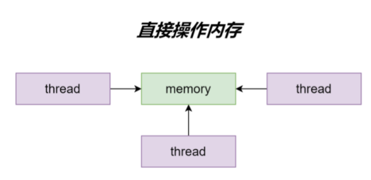
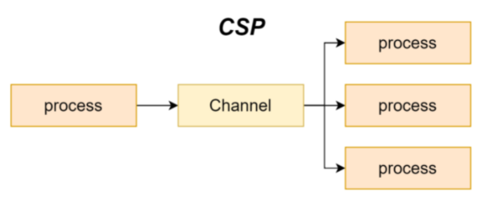
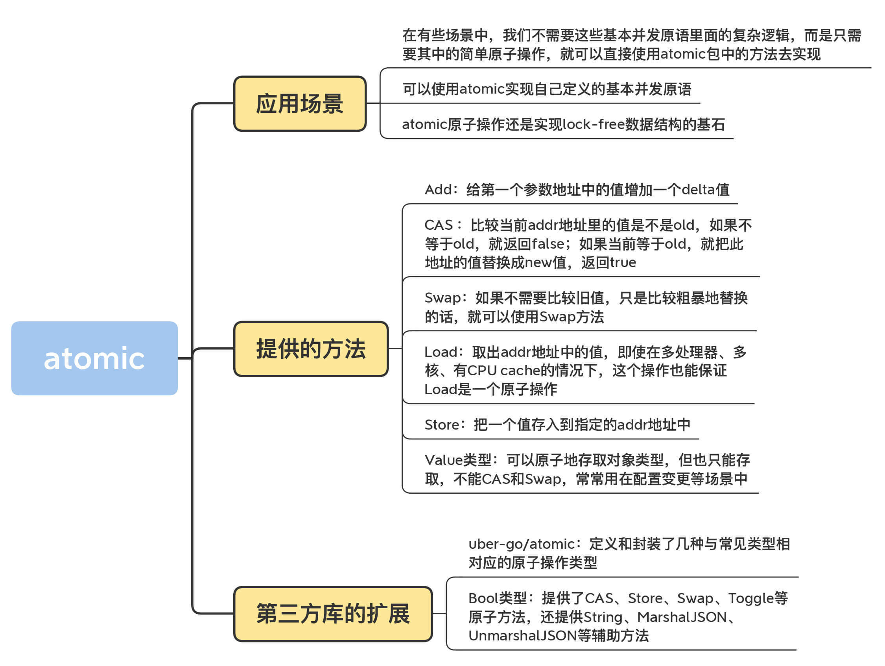
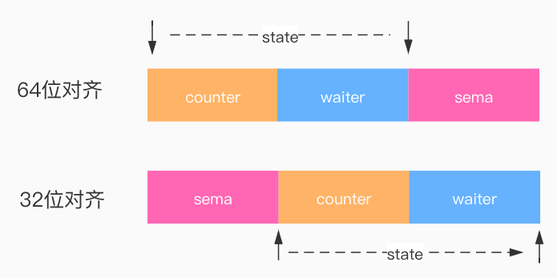

#GOland 并发模型

###线程间通信方式
线程间存在两种通讯方式  
1.共享内存  
2.消息传递  
同时通过内存获取数据

###共享内存
抽象层级：抽象层级低。对资源进行细粒度或对性能有高要求使用
耦合：高
线程竞争：需要加锁

###发送消息
抽象层级：高，提供封装和耦合设计（channel）
耦合：低
线程竞争：同一时间只有1个线程访问

goland 2种并发模型
1.共享内存模型
2.csp模型

###共享内存模型


###CSP并发模型
通过发送消息的方式来同步信息，Go语言推荐使用的通信顺序进程（communicating sequential processes）并发模型，通过goroutine和channel来实现

goroutine 是Go语言中并发的执行单位，可以理解为”线程“
channel是Go语言中各个并发结构体(goroutine)之前的通信机制。 通俗的讲，就是各个goroutine之间通信的”管道“，类似于Linux中的管道

##Go 有哪些并发同步原语
###原子操作
Mutex、RWMutex 等并发原语的底层实现是通过 atomic 包中的一些原子操作来实现的，原子操作是最基础的并发原语

``` 
package main

import (
    "fmt"
    "sync/atomic"
)

var opts int64 = 0

func main() {
    add(&opts, 3)
    load(&opts)
    compareAndSwap(&opts, 3, 4)
    swap(&opts, 5)
    store(&opts, 6)
}

func add(addr *int64, delta int64) {
    atomic.AddInt64(addr, delta) //加操作
    fmt.Println("add opts: ", *addr)
}

func load(addr *int64) {
    fmt.Println("load opts: ", atomic.LoadInt64(&opts))
}

func compareAndSwap(addr *int64, oldValue int64, newValue int64) {
    if atomic.CompareAndSwapInt64(addr, oldValue, newValue) {
        fmt.Println("cas opts: ", *addr)
        return
    }
}

func swap(addr *int64, newValue int64) {
    atomic.SwapInt64(addr, newValue)
    fmt.Println("swap opts: ", *addr)
}

func store(addr *int64, newValue int64) {
    atomic.StoreInt64(addr, newValue)
    fmt.Println("store opts: ", *addr)
}

```

###Channel
channel 管道，高级同步原语，goroutine之间通信的桥梁

使用场景：消息队列、数据传递、信号通知、任务编排、锁

``` 
package main

import (
    "fmt"
    "time"
)

func main() {
    c := make(chan struct{}, 1)
    for i := 0; i < 10; i++ {
        go func() {
            c <- struct{}{}
            time.Sleep(1 * time.Second)
            fmt.Println("通过ch访问临界区")
            <-c
        }()
    }
    for {
    }
}

```

###基本并发原语
Go 语言在 sync包中提供了用于同步的一些基本原语，这些基本原语提供了较为基础的同步功能，但是它们是一种相对原始的同步机制，在多数情况下，我们都应该使用抽象层级更高的 Channel 实现同步。

常见的并发原语如下：sync.Mutex、sync.RWMutex、sync.WaitGroup、sync.Cond、sync.Once、sync.Pool、sync.Context

####sync.Mutex
sync.Mutex （互斥锁） 可以限制对临界资源的访问，保证只有一个 goroutine 访问共享资源

使用场景：大量读写，比如多个 goroutine 并发更新同一个资源，像计数器
``` 
package main

import (
    "fmt"
    "sync"
)

func main() {
    // 封装好的计数器
    var counter Counter
    var wg sync.WaitGroup
    var gNum = 1000
    wg.Add(gNum)
    // 启动10个goroutine
    for i := 0; i < gNum; i++ {
        go func() {
            defer wg.Done()
            counter.Incr() // 受到锁保护的方法
        }()
    }
    wg.Wait()
    fmt.Println(counter.Count())
}

// 线程安全的计数器类型
type Counter struct {
    mu    sync.Mutex
    count uint64
}

// 加1的方法，内部使用互斥锁保护
func (c *Counter) Incr() {
    c.mu.Lock()
    c.count++
    c.mu.Unlock()
}

// 得到计数器的值，也需要锁保护
func (c *Counter) Count() uint64 {
    c.mu.Lock()
    defer c.mu.Unlock()
    return c.count
}
```

####sync.RWMutex
sync.RWMutex （读写锁） 可以限制对临界资源的访问，保证只有一个 goroutine 写共享资源，可以有多个goroutine 读共享资源

使用场景：大量并发读，少量并发写，有强烈的性能要求

``` 
package main

import (
    "fmt"
    "sync"
    "time"
)

func main() {
    // 封装好的计数器
    var counter Counter
    var gNum = 1000
    // 启动10个goroutine
    for i := 0; i < gNum; i++ {
        go func() {
            counter.Count() // 受到锁保护的方法
        }()
    }
    for { // 一个writer
        counter.Incr() // 计数器写操作
        fmt.Println("incr")
        time.Sleep(time.Second)
    }
}

// 线程安全的计数器类型
type Counter struct {
    mu    sync.RWMutex
    count uint64
}

// 加1的方法，内部使用互斥锁保护
func (c *Counter) Incr() {
    c.mu.Lock()
    c.count++
    c.mu.Unlock()
}

// 得到计数器的值，也需要锁保护
func (c *Counter) Count() uint64 {
    c.mu.RLock()
    defer c.mu.RUnlock()
    return c.count
}

```

####sync.WaitGroup
sync.WaitGroup 可以等待一组 Goroutine 的返回

使用场景：并发等待，任务编排，一个比较常见的使用场景是批量发出 RPC 或者 HTTP 请求

``` 
requests := []*Request{...}
wg := &sync.WaitGroup{}
wg.Add(len(requests))

for _, request := range requests {
    go func(r *Request) {
        defer wg.Done()
        // res, err := service.call(r)
    }(request)
}
wg.Wait()

```

####sync.Cond
sync.Cond 可以让一组的 Goroutine 都在满足特定条件时被唤醒

使用场景：利用等待 / 通知机制实现阻塞或者唤醒
``` 
package main

import (
    "fmt"
    "sync"
    "sync/atomic"
    "time"
)

var status int64

func main() {
    c := sync.NewCond(&sync.Mutex{})
    for i := 0; i < 10; i++ {
        go listen(c)
    }
    time.Sleep(1 * time.Second)
    go broadcast(c)
    time.Sleep(1 * time.Second)
}

func broadcast(c *sync.Cond) {
    c.L.Lock()
    atomic.StoreInt64(&status, 1)
    c.Signal()
    c.L.Unlock()
}

func listen(c *sync.Cond) {
    c.L.Lock()
    for atomic.LoadInt64(&status) != 1 {
        c.Wait()
    }
    fmt.Println("listen")
    c.L.Unlock()
}
```

####sync.Once
sync.Once 可以保证在 Go 程序运行期间的某段代码只会执行一次

使用场景：常常用于单例对象的初始化场景
``` 
package main

import (
    "fmt"
    "sync"
)

func main() {
    o := &sync.Once{}
    for i := 0; i < 10; i++ {
        o.Do(func() {
            fmt.Println("only once")
        })
    }
}
```

####sync.Pool
sync.Pool可以将暂时将不用的对象缓存起来，待下次需要的时候直接使用，不用再次经过内存分配，复用对象的内存，减轻 GC 的压力，提升系统的性能（频繁地分配、回收内存会给 GC 带来一定的负担，严重的时候会引起 CPU 的毛刺）

使用场景：对象池化， TCP连接池、数据库连接池、Worker Pool
``` 
package main

import (
    "fmt"
    "sync"
)

func main() {
    pool := sync.Pool{
        New: func() interface{} {
            return 0
        },
    }

    for i := 0; i < 10; i++ {
        v := pool.Get().(int)
        fmt.Println(v) // 取出来的值是put进去的，对象复用；如果是新建对象，则取出来的值为0
        pool.Put(i)
    }
}

```

####sync.Map
sync.Map 线程安全的map

使用场景：map 并发读写

``` 
package main

import (
    "fmt"
    "sync"
)

func main() {
    var scene sync.Map
    // 将键值对保存到sync.Map
    scene.Store("1", 1)
    scene.Store("2", 2)
    scene.Store("3", 3)
    // 从sync.Map中根据键取值
    fmt.Println(scene.Load("1"))
    // 根据键删除对应的键值对
    scene.Delete("1")
    // 遍历所有sync.Map中的键值对
    scene.Range(func(k, v interface{}) bool {
        fmt.Println("iterate:", k, v)
        return true
    })
}

```

####sync.Context
sync.Context 可以进行上下文信息传递、提供超时和取消机制、控制子 goroutine 的执行

使用场景：取消一个goroutine的执行
``` 
package main

import (
    "context"
    "fmt"
    "time"
)

func main() {
    ctx, cancel := context.WithCancel(context.Background())
    go func() {
        defer func() {
            fmt.Println("goroutine exit")
        }()
        for {
            select {
            case <-ctx.Done():
                fmt.Println("receive cancel signal!")
                return
            default:
                fmt.Println("default")
                time.Sleep(time.Second)
            }
        }
    }()
    time.Sleep(time.Second)
    cancel()
    time.Sleep(2 * time.Second)
}

```


###Go WaitGroup实现原理
Go标准库提供了WaitGroup原语, 可以用它来等待一批 Goroutine 结束
``` 
// A WaitGroup must not be copied after first use.
type WaitGroup struct {
 noCopy noCopy
 state1 [3]uint32
}

其中 noCopy 是 golang 源码中检测禁止拷贝的技术。如果程序中有 WaitGroup 的赋值行为，使用 go vet 检查程序时，就会发现有报错。但需要注意的是，noCopy 不会影响程序正常的编译和运行。

state1主要是存储着状态和信号量，状态维护了 2 个计数器，一个是请求计数器counter ，另外一个是等待计数器waiter（已调用 WaitGroup.Wait 的 goroutine 的个数）

当数组的首地址是处于一个8字节对齐的位置上时，那么就将这个数组的前8个字节作为64位值使用表示状态，后4个字节作为32位值表示信号量(semaphore)；同理如果首地址没有处于8字节对齐的位置上时，那么就将前4个字节作为semaphore，后8个字节作为64位数值。
```




####使用方法
``` 
在WaitGroup里主要有3个方法：

WaitGroup.Add()：可以添加或减少请求的goroutine数量，Add(n) 将会导致 counter += n
WaitGroup.Done()：相当于Add(-1)，Done() 将导致 counter -=1，请求计数器counter为0 时通过信号量调用runtime_Semrelease唤醒waiter线程
WaitGroup.Wait()：会将 waiter++，同时通过信号量调用 runtime_Semacquire(semap)阻塞当前 goroutine

func main() {
    var wg sync.WaitGroup
    for i := 1; i <= 5; i++ {
        wg.Add(1)
        go func() {
            defer wg.Done()
            println("hello")
        }()
    }

    wg.Wait()
}

```

###Go Cond实现原理
Go标准库提供了Cond原语，可以让 Goroutine 在满足特定条件时被阻塞和唤醒

#### 底层数据结构
``` 
type Cond struct {
    noCopy noCopy

    // L is held while observing or changing the condition
    L Locker

    notify  notifyList
    checker copyChecker
}

type notifyList struct {
    wait   uint32
    notify uint32
    lock   uintptr // key field of the mutex
    head   unsafe.Pointer
    tail   unsafe.Pointer
}


主要有4个字段：

nocopy ： golang 源码中检测禁止拷贝的技术。如果程序中有 WaitGroup 的赋值行为，使用 go vet 检查程序时，就会发现有报错，但需要注意的是，noCopy 不会影响程序正常的编译和运行
checker：用于禁止运行期间发生拷贝，双重检查(Double check)
L：可以传入一个读写锁或互斥锁，当修改条件或者调用Wait方法时需要加锁
notify：通知链表，调用Wait()方法的Goroutine会放到这个链表中，从这里获取需被唤醒的Goroutine列表
```

####使用方法
``` 
在Cond里主要有3个方法：

sync.NewCond(l Locker): 新建一个 sync.Cond 变量，注意该函数需要一个 Locker 作为必填参数，这是因为在 cond.Wait() 中底层会涉及到 Locker 的锁操作

Cond.Wait(): 阻塞等待被唤醒，调用Wait函数前需要先加锁；并且由于Wait函数被唤醒时存在虚假唤醒等情况，导致唤醒后发现，条件依旧不成立，因此需要使用 for 语句来循环地进行等待，直到条件成立为止

Cond.Signal(): 只唤醒一个最先 Wait 的 goroutine，可以不用加锁

Cond.Broadcast(): 唤醒所有Wait的goroutine，可以不用加锁

package main

import (
    "fmt"
    "sync"
    "sync/atomic"
    "time"
)

var status int64

func main() {
    c := sync.NewCond(&sync.Mutex{})
    for i := 0; i < 10; i++ {
        go listen(c)
    }
    go broadcast(c)
    time.Sleep(1 * time.Second)
}

func broadcast(c *sync.Cond) {
    // 原子操作
    atomic.StoreInt64(&status, 1) 
    c.Broadcast()
}

func listen(c *sync.Cond) {
    c.L.Lock()
    for atomic.LoadInt64(&status) != 1 {
        c.Wait() 
        // Wait 内部会先调用 c.L.Unlock()，来先释放锁，如果调用方不先加锁的话，会报错
    }
    fmt.Println("listen")
    c.L.Unlock()
}


```


###读取共享内存
```   

方法	                        并发原语	      备注
不要修改变量	               sync.Once	不要去写变量，变量只初始化一次

只允许一个goroutine访问变量	Channel	     不要通过共享变量来通信，通过通信(channel)来共享变量

允许多个goroutine访问变量，
但是同一时间只允许一个
goroutine访问	           sync.Mutex、sync.RWMutex、原子操作	实现锁机制，同时只有一个线程能拿到锁

```