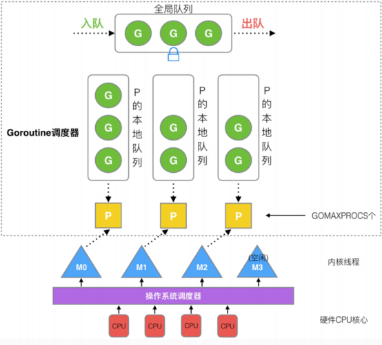
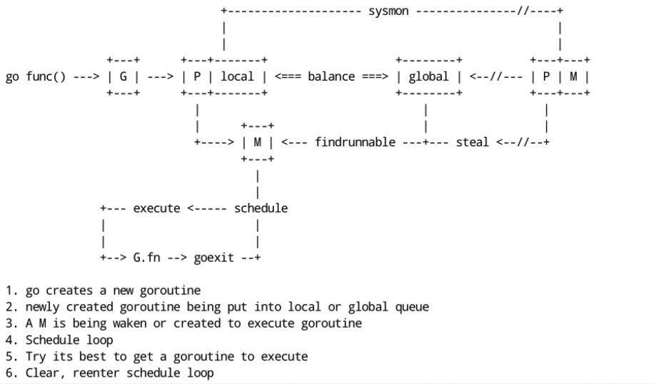
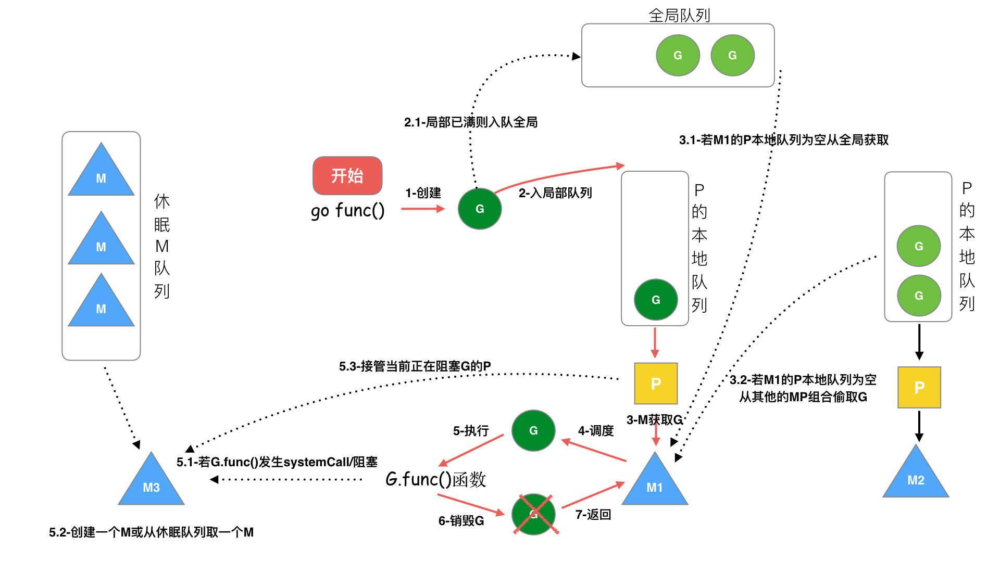
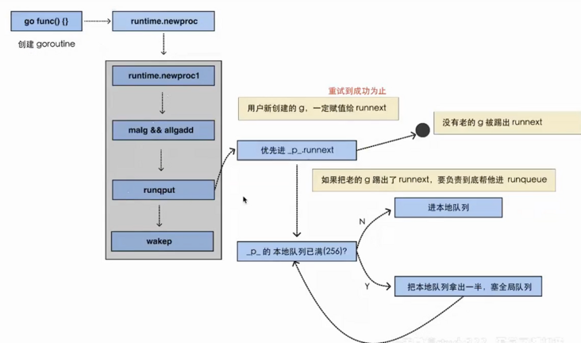
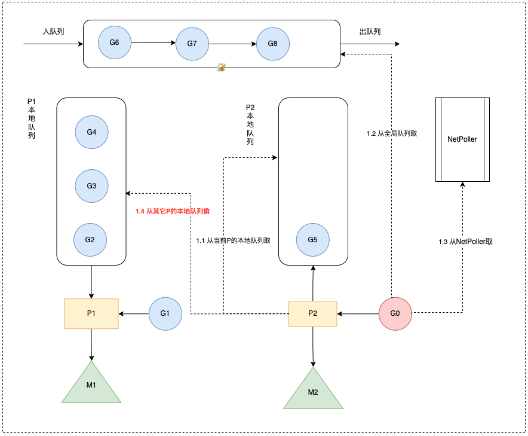

# GMP

GMP是Go运行时调度层面的实现，包含4个重要结构，分别是G、M、P、Sched



``` 
G（Goroutine）：代表Go 协程Goroutine，存储了 Goroutine 的执行栈信息、Goroutine 状态以及 Goroutine 的任务函数等。G的数量无限制，
理论上只受内存的影响，创建一个 G 的初始栈大小为2-4K，配置一般的机器也能简简单单开启数十万个 Goroutine ，而且Go语言在 G 退出的时候还会把 G 清理之后放到 P 本地或者全局的闲置列表 
gFree 中以便复用。

M（Machine）： Go 对操作系统线程（OS thread）的封装，
可以看作操作系统内核线程，想要在 CPU 上执行代码必须有线程，通过系统调用 clone 创建。M在绑定有效的 P 后，
进入一个调度循环，而调度循环的机制大致是从 P 的本地运行队列以及全局队列中获取 G，
切换到 G 的执行栈上并执行 G 的函数，调用 goexit 做清理工作并回到 M，如此反复。M 并不保留 G 状态，
这是 G 可以跨 M 调度的基础。M的数量有限制，默认数量限制是 10000，可以通过 debug.SetMaxThreads() 
方法进行设置，如果有M空闲，那么就会回收或者睡眠。

**P（Processor）：虚拟处理器，
M执行G所需要的资源和上下文，只有将 P 和 M 绑定，才能让 P 的 runq 中的 G 真正运行起来。P 的数量决定了系统内最大可并行的 G 的数量，**P的数量受本机的CPU核数影响，可通过环境变量$GOMAXPROCS或在runtime.GOMAXPROCS()来设置，默认为CPU核心数。

Sched：调度器结构，它维护有存储M和G的全局队列，以及调度器的一些状态信息

         G	                             M	                                              P
数量限制	无限制，受机器内存影响	        有限制，默认最多10000	                     有限制，最多GOMAXPROCS个
创建时机	go func	           当没有足够的M来关联P并运行其中的可运行的G时会请求创建新的M 	在确定了P的最大数量n后，运行时系统会根据这个数量创建个P
```

``` 
//src/runtime/runtime2.go
type g struct {
    goid    int64 // 唯一的goroutine的ID
    sched gobuf // goroutine切换时，用于保存g的上下文
    stack stack // 栈
  gopc        // pc of go statement that created this goroutine
    startpc    uintptr // pc of goroutine function
    ...
}

type p struct {
    lock mutex
    id          int32
    status      uint32 // one of pidle/prunning/...

    // Queue of runnable goroutines. Accessed without lock.
    runqhead uint32 // 本地队列队头
    runqtail uint32 // 本地队列队尾
    runq     [256]guintptr // 本地队列，大小256的数组，数组往往会被都读入到缓存中，对缓存友好，效率较高
    runnext guintptr // 下一个优先执行的goroutine（一定是最后生产出来的)，为了实现局部性原理，runnext中的G永远会被最先调度执行
    ... 
}

type m struct {
    g0            *g     
    // 每个M都有一个自己的G0，不指向任何可执行的函数，在调度或系统调用时，M会切换到G0，使用G0的栈空间来调度
    curg          *g    
    // 当前正在执行的G
    ... 
}

type schedt struct {
    ...
    runq     gQueue // 全局队列，链表（长度无限制）
    runqsize int32  // 全局队列长度
    ...
}

```

GMP模型的实现算是Go调度器的一大进步，但调度器仍然有一个令人头疼的问题，那就是不支持抢占式调度，这导致一旦某个 G 中出现死循环的代码逻辑，那么 G 将永久占用分配给它的 P 和 M，而位于同一个 P 中的其他 G 将得不到调度，出现“饿死”的情况。

当只有一个 P（GOMAXPROCS=1）时，整个 Go 程序中的其他 G 都将“饿死”。于是在 Go 1.2 版本中实现了基于协作的“抢占式”调度，在Go 1.14 版本中实现了基于信号的“抢占式”调度。


goroutine调度的本质就是将 **Goroutine (G）**按照一定算法放到CPU上去执行。

CPU感知不到Goroutine，只知道内核线程，所以需要Go调度器将协程调度到内核线程上面去，然后操作系统调度器将内核线程放到CPU上去执行

M是对内核级线程的封装，所以Go调度器的工作就是将G分配到M

Go 调度器的实现不是一蹴而就的，它的调度模型与算法也是几经演化，从最初的 GM 模型、到 GMP模型，从不支持抢占，到支持协作式抢占，再到支持基于信号的异步抢占，经历了不断地优化与打磨。

##设计思想
线程复用（work stealing 机制和hand off 机制）

利用并行（利用多核CPU）

抢占调度（解决公平性问题）

## 调度对象
Go 调度器

Go 调度器是属于Go runtime中的一部分，Go runtime负责实现Go的并发调度、垃圾回收、内存堆栈管理等关键功能

## 被调度对象
G的来源

P的runnext（只有1个G，局部性原理，永远会被最先调度执行）
P的本地队列（数组，最多256个G）
全局G队列（链表，无限制）
网络轮询器network poller（存放网络调用被阻塞的G）
P的来源

全局P队列（数组，GOMAXPROCS个P）
M的来源

休眠线程队列（未绑定P，长时间休眠会等待GC回收销毁）
运行线程（绑定P，指向P中的G）
自旋线程（绑定P，指向M的G0）
其中运行线程数 + 自旋线程数 <= P的数量（GOMAXPROCS），M个数 >= P个数

## 调度流程
协程的调度采用了生产者-消费者模型，实现了用户任务与调度器的解耦





```
生产端我们开启的每个协程都是一个计算任务，这些任务会被提交给 go 的 runtime。如果计算任务非常多，有成千上万个，那么这些任务是不可能同时被立刻执行的，所以这个计算任务一定会被先暂存起来，一般的做法是放到内存的队列中等待被执行。

G的生命周期：G 从创建、保存、被获取、调度和执行、阻塞、销毁，步骤如下：

步骤 1：创建 G，关键字 go func() 创建 G 

步骤 2：保存 G，创建的 G 优先保存到本地队列 P，如果 P 满了，则会平衡部分P到全局队列中

步骤3：唤醒或者新建M执行任务，进入调度循环（步骤4,5,6)

步骤 4：M 获取 G，M首先从P的本地队列获取 G，如果 P为空，则从全局队列获取 G，如果全局队列也为空，则从另一个本地队列偷取一半数量的 G（负载均衡），这种从其它P偷的方式称之为 work stealing

步骤 5：M 调度和执行 G，M调用 G.func() 函数执行 G

如果 M在执行 G 的过程发生系统调用阻塞（同步），会阻塞G和M（操作系统限制），此时P会和当前M解绑，并寻找新的M，如果没有空闲的M就会新建一个M ，接管正在阻塞G所属的P，接着继续执行 P中其余的G，这种阻塞后释放P的方式称之为hand off。当系统调用结束后，这个G会尝试获取一个空闲的P执行，优先获取之前绑定的P，并放入到这个P的本地队列，如果获取不到P，那么这个线程M变成休眠状态，加入到空闲线程中，然后这个G会被放入到全局队列中。
如果M在执行G的过程发生网络IO等操作阻塞时（异步），阻塞G，不会阻塞M。M会寻找P中其它可执行的G继续执行，G会被网络轮询器network poller 接手，当阻塞的G恢复后，G1从network poller 被移回到P的 LRQ 中，重新进入可执行状态。异步情况下，通过调度，Go scheduler 成功地将 I/O 的任务转变成了 CPU 任务，或者说将内核级别的线程切换转变成了用户级别的 goroutine 切换，大大提高了效率。
步骤6：M执行完G后清理现场，重新进入调度循环（将M上运⾏的goroutine切换为G0，G0负责调度时协程的切换）

其中步骤2中保存 G的详细流程如下：

执行 go func 的时候，主线程 M0 会调用 newproc()生成一个 G 结构体，这里会先选定当前 M0 上的 P 结构
每个协程 G 都会被尝试先放到 P 中的 runnext，若 runnext 为空则放到 runnext 中，生产结束
若 runnext 满，则将原来 runnext 中的 G 踢到本地队列中，将当前 G 放到 runnext 中，生产结束
若本地队列也满了，则将本地队列中的 G 拿出一半，放到全局队列中，生产结束。
```



``` 
调度时机
什么时候进行调度（执行/切换）？

在以下情形下，会切换正在执行的goroutine

抢占式调度
sysmon 检测到协程运行过久（比如sleep，死循环）
切换到g0，进入调度循环
主动调度
新起一个协程和协程执行完毕
触发调度循环
主动调用runtime.Gosched()
切换到g0，进入调度循环
垃圾回收之后
stw之后，会重新选择g开始执行
被动调度
系统调用（比如文件IO）阻塞（同步）
阻塞G和M，P与M分离，将P交给其它M绑定，其它M执行P的剩余G
网络IO调用阻塞（异步）
阻塞G，G移动到NetPoller，M执行P的剩余G
atomic/mutex/channel等阻塞（异步）
阻塞G，G移动到channel的等待队列中，M执行P的剩余G
#调度策略
```

## 调度策略
使用什么策略来挑选下一个goroutine执行？

由于 P 中的 G 分布在 runnext、本地队列、全局队列、网络轮询器中，则需要挨个判断是否有可执行的 G，大体逻辑如下：

每执行61次调度循环，从全局队列获取G，若有则直接返回
从P 上的 runnext 看一下是否有 G，若有则直接返回
从P 上的 本地队列 看一下是否有 G，若有则直接返回
上面都没查找到时，则去全局队列、网络轮询器查找或者从其他 P 中窃取，一直阻塞直到获取到一个可用的 G 为止
源码实现如下：

``` 
func schedule() {
    _g_ := getg()
    var gp *g
    var inheritTime bool
    ...
    if gp == nil {
        // 每执行61次调度循环会看一下全局队列。为了保证公平，避免全局队列一直无法得到执行的情况，当全局运行队列中有待执行的G时，通过schedtick保证有一定几率会从全局的运行队列中查找对应的Goroutine；
        if _g_.m.p.ptr().schedtick%61 == 0 && sched.runqsize > 0 {
            lock(&sched.lock)
            gp = globrunqget(_g_.m.p.ptr(), 1)
            unlock(&sched.lock)
        }
    }
    if gp == nil {
        // 先尝试从P的runnext和本地队列查找G
        gp, inheritTime = runqget(_g_.m.p.ptr())
    }
    if gp == nil {
        // 仍找不到，去全局队列中查找。还找不到，要去网络轮询器中查找是否有G等待运行；仍找不到，则尝试从其他P中窃取G来执行。
        gp, inheritTime = findrunnable() // blocks until work is available
        // 这个函数是阻塞的，执行到这里一定会获取到一个可执行的G
    }
    ...
    // 调用execute，继续调度循环
    execute(gp, inheritTime)
}

```
从全局队列查找时，如果要所有 P 平分全局队列中的 G，每个 P 要分得多少个，这里假设会分得 n 个。然后把这 n 个 G，转移到当前 G 所在 P 的本地队列中去。但是最多不能超过 P 本地队列长度的一半（即 128）。这样做的目的是，如果下次调度循环到来的时候，就不必去加锁到全局队列中在获取一次 G 了，性能得到了很好的保障。


``` 
func globrunqget(_p_ *p, max int32) *g {
   ...
   // gomaxprocs = p的数量
   // sched.runqsize是全局队列长度
   // 这里n = 全局队列的G平分到每个P本地队列上的数量 + 1
   n := sched.runqsize/gomaxprocs + 1
   if n > sched.runqsize {
      n = sched.runqsize
   }
   if max > 0 && n > max {
      n = max
   }
   // 平分后的数量n不能超过本地队列长度的一半，也就是128
   if n > int32(len(_p_.runq))/2 {
      n = int32(len(_p_.runq)) / 2
   }

   // 执行将G从全局队列中取n个分到当前P本地队列的操作
   sched.runqsize -= n

   gp := sched.runq.pop()
   n--
   for ; n > 0; n-- {
      gp1 := sched.runq.pop()
      runqput(_p_, gp1, false)
   }
   return gp
}

```
从其它P查找时，会偷一半的G过来放到当前P的本地队列

## Go work stealing 机制

概念
当线程M⽆可运⾏的G时，尝试从其他M绑定的P偷取G，减少空转，提高了线程利用率（避免闲着不干活）。

当从本线程绑定 P 本地 队列、全局G队列、netpoller都找不到可执行的 g，会从别的 P 里窃取G并放到当前P上面。

从netpoller 中拿到的G是_Gwaiting状态（ 存放的是因为网络IO被阻塞的G），从其它地方拿到的G是_Grunnable状态

从全局队列取的G数量：N = min(len(GRQ)/GOMAXPROCS + 1, len(GRQ/2)) （根据GOMAXPROCS负载均衡）

从其它P本地队列窃取的G数量：N = len(LRQ)/2（平分）


## 窃取流程
源码见runtime/proc.go stealWork函数，窃取流程如下，如果经过多次努力一直找不到需要运行的goroutine则调用stopm进入睡眠状态，等待被其它工作线程唤醒。

选择要窃取的P

从P中偷走一半G

## 选择要窃取的P
窃取的实质就是遍历allp中的所有p，查看其运行队列是否有goroutine，如果有，则取其一半到当前工作线程的运行队列

为了保证公平性，遍历allp时并不是固定的从allp[0]即第一个p开始，而是从随机位置上的p开始，而且遍历的顺序也随机化了，并不是现在访问了第i个p下一次就访问第i+1个p，而是使用了一种伪随机的方式遍历allp中的每个p，防止每次遍历时使用同样的顺序访问allp中的元素


``` 
offset := uint32(random()) % nprocs
coprime := 随机选取一个小于nprocs且与nprocs互质的数
const stealTries = 4 // 最多重试4次
for i := 0; i < stealTries; i++ {
    for i := 0; i < nprocs; i++ {
      p := allp[offset]
        从p的运行队列偷取goroutine
        if 偷取成功 {
        break
     }
        offset += coprime
        offset = offset % nprocs
     }
}

```
可以看到只要随机数不一样，偷取p的顺序也不一样，但可以保证经过nprocs次循环，每个p都会被访问到。

## 从P中偷走一半G
源码见runtime/proc.go runqsteal函数：

挑选出盗取的对象p之后，则调用runqsteal盗取p的运行队列中的goroutine，runqsteal函数再调用runqgrap从p的本地队列尾部批量偷走一半的g

为啥是偷一半的g，可以理解为负载均衡

``` 
func runqgrab(_p_ *p, batch *[256]guintptr, batchHead uint32, stealRunNextG bool) uint32 {
    for {
        h := atomic.LoadAcq(&_p_.runqhead) // load-acquire, synchronize with other consumers
        t := atomic.LoadAcq(&_p_.runqtail) // load-acquire, synchronize with the producer
        n := t - h        //计算队列中有多少个goroutine
        n = n - n/2     //取队列中goroutine个数的一半
        if n == 0 {
            ......
            return ......
        }
        return n
    }
}

```

## Go hand off 机制

也称为P分离机制，当本线程 M 因为 G 进行的系统调用阻塞时，线程释放绑定的 P，把 P 转移给其他空闲的 M 执行，也提高了线程利用率（避免站着茅坑不拉shi）。

###分离流程
当前线程M阻塞时，释放P，给其它空闲的M处理
