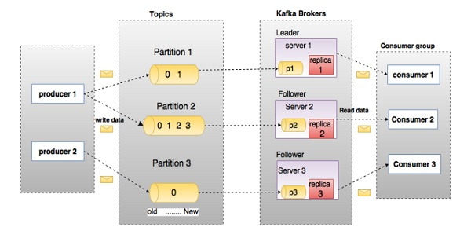
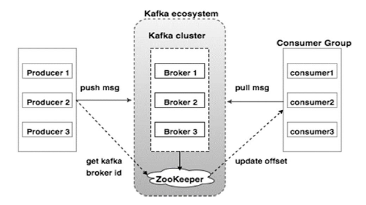

#kafka


##简介
我们知道流处理平台有以下三种特性:

可以让你发布和订阅流式的记录。这一方面与消息队列或者企业消息系统类似。
可以储存流式的记录，并且有较好的容错性。
可以在流式记录产生时就进行处理。
Kafka适合什么样的场景?

它可以用于两大类别的应用:

``` 
构造实时流数据管道，它可以在系统或应用之间可靠地获取数据。 (相当于message queue)

构建实时流式应用程序，对这些流数据进行转换或者影响。 (就是流处理，通过kafka stream topic和topic之间内部进行变化)
为了理解Kafka是如何做到以上所说的功能，从下面开始，我们将深入探索Kafka的特性。.

```
首先是一些概念:

``` 
Kafka作为一个集群，运行在一台或者多台服务器上.
Kafka 通过 topic 对存储的流数据进行分类。
每条记录中包含一个key，一个value和一个timestamp（时间戳）。
Kafka有四个核心的API:

The Producer API 允许一个应用程序发布一串流式的数据到一个或者多个Kafka topic。
The Consumer API 允许一个应用程序订阅一个或多个 topic ，并且对发布给他们的流式数据进行处理。
The Streams API 允许一个应用程序作为一个流处理器，消费一个或者多个topic产生的输入流，然后生产一个输出流到一个或多个topic中去，在输入输出流中进行有效的转换。
The Connector API 允许构建并运行可重用的生产者或者消费者，将Kafka topics连接到已存在的应用程序或者数据系统。比如，连接到一个关系型数据库，捕捉表（table）的所有变更内容。

在Kafka中，客户端和服务器使用一个简单、高性能、支持多语言的 TCP 协议.此协议版本化并且向下兼容老版本， 我们为Kafka提供了Java客户端，也支持许多其他语言的客户端。


```

###组件明细说明




``` 
在上图中，一个主题被配置为三个分区。 
分区 1 有两个偏移因子 0 和 1。
分区 2 有四个偏移因子 0、1、2 和 3。
分区 3 有一个偏移因子 0。副本的 id 与托管它的服务器的 id 相同。

假设，如果主题的复制因子设置为 3，那么 Kafka 将为每个分区创建 3 个相同的副本，
并将它们放置在集群中以供其所有操作使用。
 为了平衡集群中的负载，每个代理存储一个或多个这些分区。 
 多个生产者和消费者可以同时发布和检索消息。
```

``` 
1	Topics

属于特定类别的消息流称为主题。 数据存储在主题中。

主题被分成多个分区。 对于每个主题，Kafka 保留一个分区的最小数量。 每个这样的分区都包含不可变有序序列中的消息。 分区被实现为一组大小相等的段文件。

2	Partition

主题可能有很多分区，因此它可以处理任意数量的数据。

3	Partition offset

每个分区消息都有一个唯一的序列 id，称为 offset。

4	Replicas of partition

副本只不过是分区的备份。 副本永远不会读取或写入数据。 它们用于防止数据丢失。

5	Brokers

经纪人是负责维护已发布数据的简单系统。 每个代理每个主题可能有零个或多个分区。 假设一个topic有N个partition，有N个broker，那么每个broker都有一个partition。

假设如果一个主题中有 N 个分区并且超过 N 个代理 (n + m)，则第一个 N 个代理将有一个分区，而下一个 M 个代理将没有该特定主题的任何分区。

假设一个主题中有 N 个分区并且少于 N 个 broker (n-m)，每个 broker 之间将有一个或多个分区共享。 由于代理之间的负载分配不均，不建议使用此方案。

6	Kafka Cluster

拥有多个代理的 Kafka 称为 Kafka 集群。 可以在不停机的情况下扩展 Kafka 集群。 这些集群用于管理消息数据的持久性和复制。

7	Producers

生产者是一个或多个 Kafka 主题的消息发布者。 生产者向 Kafka 代理发送数据。 每次生产者向代理发布消息时，代理只需将消息附加到最后一个段文件。 实际上，消息将附加到一个分区。 生产者还可以将消息发送到他们选择的分区。

8	Consumers

消费者从经纪人那里读取数据。 消费者订阅一个或多个主题，并通过从代理中提取数据来使用已发布的消息。

9	Leader

Leader 是负责给定分区所有读写的节点。 每个分区都有一个服务器作为领导者。

10	Follower

遵循 Leader 指令的节点称为追随者。 如果leader失败，其中一个follower将自动成为新的leader。 追随者充当普通消费者，拉取消息并更新自己的数据存储。

```


##Topic
让我们首先深入了解下Kafka的核心概念:提供一串流式的记录— topic 。

Topic 就是数据主题，是数据记录发布的地方,可以用来区分业务系统。  
Kafka中的Topics总是多订阅者模式，一个topic可以拥有一个或者多个消费者来订阅它的数据。  

对于每一个topic， Kafka集群都会维持一个分区日志，如下所示：


``` 
每个分区都是有序且顺序不可变的记录集，并且不断地追加到结构化的commit log文件。
分区中的每一个记录都会分配一个id号来表示顺序，我们称之为offset，offset用来唯一的标识分区中每一条记录。

Kafka 集群保留所有发布的记录—无论他们是否已被消费—并通过一个可配置的参数——保留期限来控制.
举个例子， 如果保留策略设置为2天，一条记录发布后两天内，可以随时被消费，两天过后这条记录会被抛弃并释放磁盘空间。
Kafka的性能和数据大小无关，所以长时间存储数据没有什么问题.

```

事实上，在每一个消费者中唯一保存的元数据是offset（偏移量）即消费在log中的位置.偏移量由消费者所控制:

通常在读取记录后，消费者会以线性的方式增加偏移量，但是实际上，由于这个位置由消费者控制，所以消费者可以采用任何顺序来消费记录。
例如，一个消费者可以重置到一个旧的偏移量，从而重新处理过去的数据；也可以跳过最近的记录，从"现在"开始消费。

这些细节说明Kafka 消费者是非常廉价的—消费者的增加和减少，对集群或者其他消费者没有多大的影响。  
比如，你可以使用命令行工具，对一些topic内容执行 tail操作，并不会影响已存在的消费者消费数据。

日志中的 partition（分区）有以下几个用途
``` 
第一，当日志大小超过了单台服务器的限制，允许日志进行扩展。每个单独的分区都必须受限于主机的文件限制，不过一个主题可能有多个分区，因此可以处理无限量的数据。
第二，可以作为并行的单元集—关于这一点，更多细节如下
```

###分布式
日志的分区partition （分布）在Kafka集群的服务器上。  
每个服务器在处理数据和请求时，共享这些分区。每一个分区都会在已配置的服务器上进行备份，确保容错性.

每个分区都有一台 server 作为 “leader”，零台或者多台server作为 follwers 。  
leader server 处理一切对 partition （分区）的读写请求，而follwers只需被动的同步leader上的数据。
当leader宕机了，followers 中的一台服务器会自动成为新的 leader。  
每台 server 都会成为某些分区的 leader 和某些分区的 follower，因此集群的负载是平衡的。  

###生产者
生产者可以将数据发布到所选择的topic（主题）中。
生产者负责将记录分配到topic的哪一个 partition（分区）中。
可以使用循环的方式来简单地实现负载均衡，也可以根据某些语义分区函数(例如：记录中的key)来完成。
下面会介绍更多关于分区的使用。

###消费者
消费者使用一个 消费组 名称来进行标识，发布到topic中的每条记录被分配给订阅消费组中的一个消费者实例.
消费者实例可以分布在多个进程中或者多个机器上。

如果所有的消费者实例在同一消费组中，消息记录会负载平衡到每一个消费者实例.

如果所有的消费者实例在不同的消费组中，每条消息记录会广播到所有的消费者进程.


如图，这个 Kafka 集群有两台 server 的，四个分区(p0-p3)和两个消费者组。消费组A有两个消费者，消费组B有四个消费者。

通常情况下，每个 topic 都会有一些消费组，一个消费组对应一个"逻辑订阅者"。一个消费组由许多消费者实例组成，便于扩展和容错。这就是发布和订阅的概念，只不过订阅者是一组消费者而不是单个的进程。

在Kafka中实现消费的方式是将日志中的分区划分到每一个消费者实例上，以便在任何时间，每个实例都是分区唯一的消费者。维护消费组中的消费关系由Kafka协议动态处理。如果新的实例加入组，他们将从组中其他成员处接管一些 partition 分区;如果一个实例消失，拥有的分区将被分发到剩余的实例。

Kafka 只保证分区内的记录是有序的，而不保证主题中不同分区的顺序。每个 partition 分区按照key值排序足以满足大多数应用程序的需求。但如果你需要总记录在所有记录的上面，可使用仅有一个分区的主题来实现，这意味着每个消费者组只有一个消费者进程。

保证
high-level Kafka给予以下保证:

生产者发送到特定topic partition 的消息将按照发送的顺序处理。 也就是说，如果记录M1和记录M2由相同的生产者发送，并先发送M1记录，那么M1的偏移比M2小，并在日志中较早出现
一个消费者实例按照日志中的顺序查看记录.
对于具有N个副本的主题，我们最多容忍N-1个服务器故障，从而保证不会丢失任何提交到日志中的记录.
关于保证的更多细节可以看文档的设计部分。

###生产架构


``` 
1	Broker

Kafka 集群通常由多个代理组成以保持负载平衡。 Kafka 代理是无状态的，因此他们使用 ZooKeeper 来维护他们的集群状态。 一个 Kafka 代理实例每秒可以处理数十万次读写，每个代理可以处理 TB 的消息而不会影响性能。 Kafka broker 的领导人选举可以由 ZooKeeper 完成。

2	ZooKeeper

ZooKeeper 用于管理和协调 Kafka 代理。 ZooKeeper 服务主要用于通知生产者和消费者 Kafka 系统中是否存在任何新的代理或 Kafka 系统中的代理失败。 根据 Zookeeper 收到的关于代理存在或失败的通知，生产者和消费者做出决定并开始与其他代理协调他们的任务。

3	Producers

生产者将数据推送给经纪人。 当新代理启动时，所有生产者都会搜索它并自动向该新代理发送消息。 Kafka 生产者不等待代理的确认，而是以代理可以处理的最快速度发送消息。

4	Consumers

由于 Kafka 代理是无状态的，这意味着消费者必须通过使用分区偏移量来维护已经消费了多少消息。 如果消费者确认特定的消息偏移量，则意味着消费者已经消费了所有先前的消息。 消费者向代理发出异步拉取请求，以准备好使用的字节缓冲区。 消费者可以简单地通过提供偏移值来回退或跳到分区中的任何点。 消费者偏移值由 ZooKeeper 通知。
```


###工作流程

消息传递的工作流程
####以下是 Pub-Sub 消息传递的逐步工作流程 −
``` 
生产者定期向主题发送消息。

Kafka 代理将所有消息存储在为该特定主题配置的分区中。 它确保消息在分区之间平等共享。 
如果生产者发送两条消息并且有两个分区，Kafka 将在第一个分区中存储一条消息，在第二个分区中存储第二条消息。

消费者订阅特定主题。

一旦消费者订阅了一个主题，Kafka 将向消费者提供该主题的当前偏移量，并将该偏移量保存在 Zookeeper ensemble 中。
消费者将定期（如 100 毫秒）向 Kafka 请求新消息。

一旦 Kafka 收到来自生产者的消息，它就会将这些消息转发给消费者。
消费者将收到消息并处理它。

处理完消息后，消费者将向 Kafka 代理发送确认。
一旦 Kafka 收到确认，它将偏移量更改为新值并在 Zookeeper 中更新它。 
由于在 Zookeeper 中维护了偏移量，因此即使在服务器异常时，消费者也可以正确读取下一条消息。

上述流程将重复，直到消费者停止请求。

消费者可以随时选择回退/跳到主题的所需偏移量并阅读所有后续消息。
```

####队列消息传递/消费者组的工作流程
在队列消息系统中，而不是单个消费者，一组具有相同 Group ID 的消费者将订阅一个主题。
简单来说，订阅具有相同 Group ID 的主题的消费者被视为一个单独的组，消息在它们之间共享。
让我们检查一下这个系统的实际工作流程。
``` 
生产者定期向主题发送消息。

Kafka 将所有消息存储在为该特定主题配置的分区中，类似于之前的场景。

单个消费者订阅特定主题，假设 Topic-01 和 Group ID 为 Group-1。

Kafka 以与 Pub-Sub 消息传递相同的方式与消费者交互，直到新的消费者订阅相同的主题，Topic-01 具有与 Group- 相同的 Group ID 1。

一旦新的消费者到达，Kafka 将其操作切换到共享模式并在两个消费者之间共享数据。 
这种共享将一直持续到消费者数量达到为该特定主题配置的分区数量。

一旦消费者数量超过分区数量，新消费者将不会收到任何进一步的消息，直到现有消费者中的任何一个取消订阅。 
出现这种情况是因为 Kafka 中的每个消费者都将被分配至少一个分区，一旦所有分区都分配给现有消费者，新消费者将不得不等待。

此功能也称为消费者组。 同样，Kafka 将以非常简单和高效的方式提供两个系统中最好的部分。

```
####ZooKeeper 的角色
Apache Kafka 的一个关键依赖项是 Apache Zookeeper，它是一种分布式配置和同步服务。
Zookeeper 充当 Kafka 代理和消费者之间的协调接口。 Kafka 服务器通过 Zookeeper 集群共享信息。 Kafka 将基本元数据存储在 Zookeeper 中，例如有关主题、代理、消费者偏移量（队列读取器）等的信息。

由于所有关键信息都存储在 Zookeeper 中，并且它通常会在其整体中复制这些数据，因此 Kafka 代理/Zookeeper 的故障不会影响 Kafka 集群的状态。 一旦 Zookeeper 重新启动，Kafka 将恢复状态。 这使 Kafka 的停机时间为零。
Kafka broker 之间的领导选举也是在领导失败的情况下使用 Zookeeper 完成的。