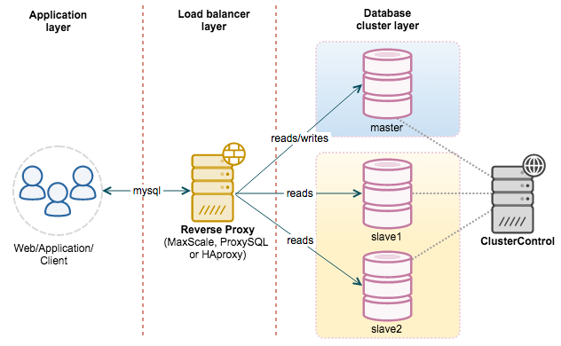

#主从复制

主从复制
``` 
主要涉及三个线程：binlog 线程、I/O 线程和 SQL 线程。

binlog 线程 ：负责将主服务器上的数据更改写入二进制日志（Binary log）中。
I/O 线程 ：负责从主服务器上读取二进制日志，并写入从服务器的中继日志（Relay log）。
SQL 线程 ：负责读取中继日志，解析出主服务器已经执行的数据更改并在从服务器中重放（Replay）。

```

#读写分离
``` 
主服务器处理写操作以及实时性要求比较高的读操作，而从服务器处理读操作。

读写分离能提高性能的原因在于：

主从服务器负责各自的读和写，极大程度缓解了锁的争用；
从服务器可以使用 MyISAM，提升查询性能以及节约系统开销；
增加冗余，提高可用性。
读写分离常用代理方式来实现，代理服务器接收应用层传来的读写请求，然后决定转发到哪个服务器。

```



##  主从复制
``` 
原理：主库将变更写binlog日志，然后从库连接到主库后，从库有一个IO线程，将主库的binlog日志拷贝到自己本地，写入一个中继日志中，接着从库中有一个sql线程会从中继日志读取binlog，
然后执行binlog日志中的内容，也就是在自己本地再执行一遍sql，这样就可以保证自己跟主库的数据一致。

问题：这里有很重要一点，就是从库同步主库数据的过程是串行化的，也就是说主库上并行操作，在从库上会串行化执行，
由于从库从主库拷贝日志以及串行化执行sql特点，在高并发情况下，
从库数据一定比主库慢一点，是有延时的，所以经常出现，刚写入主库的数据可能读不到了，要过几十毫秒，甚至几百毫秒才能读取到。还有一个问题，如果突然主库宕机了，然后恰巧数据还没有同步到从库，那么有些数据可能在从库上是没有的，有些数据可能就丢失了。所以mysql实际上有两个机制，一个是半同步复制，用来解决主库数据丢失问题，一个是并行复制，用来解决主从同步延时问题。

半同步复制：semi-sync复制，指的就是主库写入binlog日志后，
就会将强制此时立即将数据同步到从库，
从库将日志写入自己本地的relay log之后，接着会返回一个ack给主库，
主库接收到至少一个从库ack之后才会认为写完成。

并发复制：指的是从库开启多个线程，并行读取relay log中不同库的日志，
然后并行重放不同库的日志，这样库级别的并行。（将主库分库也可缓解延迟问题）
```