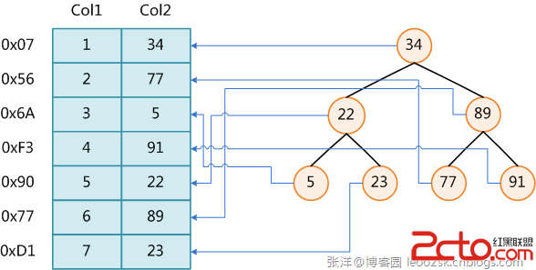
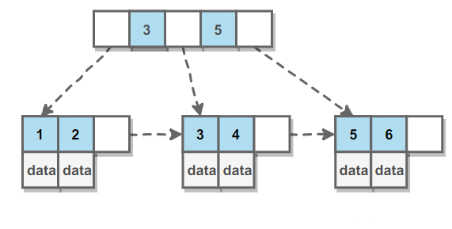

#索引
索引是关系数据库中对某一列或多个列的值进行预排序的数据结构。通过使用索引，可以让数据库系统不必扫描整个表，而是直接定位到符合条件的记录，这样就大大加快了查询速度。

数据库索引，是数据库管理系统中一个排序的数据结构，以协助快速查询、更新数据库表中数据。索引的实现通常使用B树及其变种B+树。

在数据之外，数据库系统还维护着满足特定查找算法的数据结构，这些数据结构以某种方式引用（指向）数据，这样就可以在这些数据结构上实现高级查找算法。这种数据结构，就是索引。

为表设置索引要付出代价的：一是增加了数据库的存储空间，二是在插入和修改数据时要花费较多的时间(因为索引也要随之变动)。


图展示了一种可能的索引方式。左边是数据表，一共有两列七条记录，最左边的是数据记录的物理地址（注意逻辑上相邻的记录在磁盘上也并不是一定物理相邻的）。为了加快Col2的查找，可以维护一个右边所示的二叉查找树，每个节点分别包含索引键值和一个指向对应数据记录物理地址的指针，这样就可以运用二叉查找在O(log2n)的复杂度内获取到相应数据。

``` 
优点：
第一，通过创建唯一性索引，可以保证数据库表中每一行数据的唯一性。

第二，可以大大加快数据的检索速度，这也是创建索引的最主要的原因。

第三，可以加速表和表之间的连接，特别是在实现数据的参考完整性方面特别有意义。

第四，在使用分组和排序子句进行数据检索时，同样可以显著减少查询中分组和排序的时间。

第五，通过使用索引，可以在查询的过程中，使用优化隐藏器，提高系统的性能。

缺点：
第一，创建索引和维护索引要耗费时间，这种时间随着数据量的增加而增加。

第二，索引需要占物理空间，除了数据表占数据空间之外，每一个索引还要占一定的物理空间，如果要建立聚簇索引，那么需要的空间就会更大。

第三，当对表中的数据进行增加、删除和修改的时候，索引也要动态的维护，这样就降低了数据的维护速度。
```
```
id	class_id	name	gender	score
1	1	小明	M	90
2	1	小红	F	95
3	1	小军	M	88

```
如果要经常根据score列进行查询，就可以对score列创建索引
``` 
ALTER TABLE studentsADD INDEX idx_score (score);
```
索引的效率取决于索引列的值是否散列，即该列的值如果越互不相同，那么索引效率越高。反过来，如果记录的列存在大量相同的值，例如gender列，大约一半的记录值是M，另一半是F，因此，对该列创建索引就没有意义。

可以对一张表创建多个索引。索引的优点是提高了查询效率，缺点是在插入、更新和删除记录时，需要同时修改索引，因此，索引越多，插入、更新和删除记录的速度就越慢。

对于主键，关系数据库会自动对其创建主键索引。使用主键索引的效率是最高的，因为主键会保证绝对唯一。

###索引类型
根据数据库的功能，可以在数据库设计器中创建三种索引：唯一索引、主键索引和聚集索引。

####唯一索引

唯一索引是不允许其中任何两行具有相同索引值的索引。

当现有数据中存在重复的键值时，大多数数据库不允许将新创建的唯一索引与表一起保存。数据库还可能防止添加将在表中创建重复键值的新数据。例如，如果在employee表中职员的姓(lname)上创建了唯一索引，则任何两个员工都不能同姓。 主键索引 数据库表经常有一列或列组合，其值唯一标识表中的每一行。该列称为表的主键。 在数据库关系图中为表定义主键将自动创建主键索引，主键索引是唯一索引的特定类型。该索引要求主键中的每个值都唯一。当在查询中使用主键索引时，它还允许对数据的快速访问。 聚集索引 在聚集索引中，表中行的物理顺序与键值的逻辑（索引）顺序相同。一个表只能包含一个聚集索引。

如果某索引不是聚集索引，则表中行的物理顺序与键值的逻辑顺序不匹配。与非聚集索引相比，聚集索引通常提供更快的数据访问速度。

局部性原理与磁盘预读 由于存储介质的特性，磁盘本身存取就比主存慢很多，再加上机械运动耗费，磁盘的存取速度往往是主存的几百分分之一，因此为了提高效率，要尽量减少磁盘I/O。为了达到这个目的，磁盘往往不是严格按需读取，而是每次都会预读，即使只需要一个字节，磁盘也会从这个位置开始，顺序向后读取一定长度的数据放入内存。这样做的理论依据是计算机科学中著名的局部性原理：当一个数据被用到时，其附近的数据也通常会马上被使用。程序运行期间所需要的数据通常比较集中。

由于磁盘顺序读取的效率很高（不需要寻道时间，只需很少的旋转时间），因此对于具有局部性的程序来说，预读可以提高I/O效率。

预读的长度一般为页（page）的整倍数。页是计算机管理存储器的逻辑块，硬件及操作系统往往将主存和磁盘存储区分割为连续的大小相等的块，每个存储块称为一页（在许多操作系统中，页得大小通常为4k），主存和磁盘以页为单位交换数据。当程序要读取的数据不在主存中时，会触发一个缺页异常，此时系统会向磁盘发出读盘信号，磁盘会找到数据的起始位置并向后连续读取一页或几页载入内存中，然后异常返回，程序继续运行。


###唯一索引
在设计关系数据表的时候，看上去唯一的列，例如身份证号、邮箱地址等，因为他们具有业务含义，因此不宜作为主键。

但是，这些列根据业务要求，又具有唯一性约束：即不能出现两条记录存储了同一个身份证号。这个时候，就可以给该列添加一个唯一索引。例如，我们假设students表的name不能重复：
```
ALTER TABLE studentsADD UNIQUE INDEX uni_name (name);
```

###B+树详细信息
B Tree 指的是 Balance Tree，也就是平衡树。平衡树是一颗查找树，并且所有叶子节点位于同一层。

B+ Tree 是基于 B Tree 和叶子节点顺序访问指针进行实现，它具有 B Tree 的平衡性，并且通过顺序访问指针来提高区间查询的性能。

在 B+ Tree 中，一个节点中的 key 从左到右非递减排列，如果某个指针的左右相邻 key 分别是 keyi 和 keyi+1，且不为 null，则该指针指向节点的所有 key 大于等于 keyi 且小于等于 keyi+1。



B-/+Tree索引的性能分析 到这里终于可以分析B-/+Tree索引的性能了。

上文说过一般使用磁盘I/O次数评价索引结构的优劣。先从B-Tree分析，根据B-Tree的定义，可知检索一次最多需要访问h个节点。数据库系统的设计者巧妙利用了磁盘预读原理，将一个节点的大小设为等于一个页，这样每个节点只需要一次I/O就可以完全载入。为了达到这个目的，在实际实现B-Tree还需要使用如下技巧：

每次新建节点时，直接申请一个页的空间，这样就保证一个节点物理上也存储在一个页里，加之计算机存储分配都是按页对齐的，就实现了一个node只需一次I/O。

B-Tree中一次检索最多需要h-1次I/O（根节点常驻内存），渐进复杂度为O(h)=O(logdN)。一般实际应用中，出度d是非常大的数字，通常超过100，因此h非常小（通常不超过3）。

而红黑树这种结构，h明显要深的多。由于逻辑上很近的节点（父子）物理上可能很远，无法利用局部性，所以红黑树的I/O渐进复杂度也为O(h)，效率明显比B-Tree差很多。

综上所述，用B-Tree作为索引结构效率是非常高的。
####查找操作
进行查找操作时，首先在根节点进行二分查找，找到一个 key 所在的指针，然后递归地在指针所指向的节点进行查找。直到查找到叶子节点，然后在叶子节点上进行二分查找，找出 key 所对应的 data。

插入删除操作会破坏平衡树的平衡性，因此在进行插入删除操作之后，需要对树进行分裂、合并、旋转等操作来维护平衡性。

#### 和红黑树比较
```红黑树等平衡树也可以用来实现索引，但是文件系统及数据库系统普遍采用 B+ Tree 作为索引结构，这是因为使用 B+ 树访问磁盘数据有更高的性能。
（一）B+ 树有更低的树高

平衡树的树高 O(h)=O(logdN)，其中 d 为每个节点的出度。
红黑树的出度为 2，而 B+ Tree 的出度一般都非常大，所以红黑树的树高 h 很明显比 B+ Tree 大非常多。

（二）磁盘访问原理

操作系统一般将内存和磁盘分割成固定大小的块，每一块称为一页，内存与磁盘以页为单位交换数据。
数据库系统将索引的一个节点的大小设置为页的大小，使得一次 I/O 就能完全载入一个节点。

如果数据不在同一个磁盘块上，那么通常需要移动制动手臂进行寻道，而制动手臂因为其物理结构导致了移动效率低下，从而增加磁盘数据读取时间。
B+ 树相对于红黑树有更低的树高，进行寻道的次数与树高成正比，
在同一个磁盘块上进行访问只需要很短的磁盘旋转时间，所以 B+ 树更适合磁盘数据的读取。

（三）磁盘预读特性

为了减少磁盘 I/O 操作，磁盘往往不是严格按需读取，而是每次都会预读。
预读过程中，磁盘进行顺序读取，顺序读取不需要进行磁盘寻道，并且只需要很短的磁盘旋转时间，速度会非常快。
并且可以利用预读特性，相邻的节点也能够被预先载入。
```

###哈希索引
哈希索引能以 O(1) 时间进行查找，但是失去了有序性：

无法用于排序与分组；
只支持精确查找，无法用于部分查找和范围查找。
InnoDB 存储引擎有一个特殊的功能叫“自适应哈希索引”，当某个索引值被使用的非常频繁时，会在 B+Tree 索引之上再创建一个哈希索引，这样就让 B+Tree 索引具有哈希索引的一些优点，比如快速的哈希查找。

###全文索引
MyISAM 存储引擎支持全文索引，用于查找文本中的关键词，而不是直接比较是否相等。

查找条件使用 MATCH AGAINST，而不是普通的 WHERE。

全文索引使用倒排索引实现，它记录着关键词到其所在文档的映射。

InnoDB 存储引擎在 MySQL 5.6.4 版本中也开始支持全文索引。

###空间数据索引
MyISAM 存储引擎支持空间数据索引（R-Tree），可以用于地理数据存储。空间数据索引会从所有维度来索引数据，可以有效地使用任意维度来进行组合查询。

必须使用 GIS 相关的函数来维护数据。


###索引优化
索引优化
####1. 独立的列
在进行查询时，索引列不能是表达式的一部分，也不能是函数的参数，否则无法使用索引。

例如下面的查询不能使用 actor_id 列的索引：
```
SELECT actor_id FROM sakila.actor WHERE actor_id + 1 = 5;
```
####2. 多列索引
在需要使用多个列作为条件进行查询时，使用多列索引比使用多个单列索引性能更好。例如下面的语句中，最好把 actor_id 和 film_id 设置为多列索引。

``` 
SELECT film_id, actor_ id FROM sakila.film_actor
WHERE actor_id = 1 AND film_id = 1;
```

####3. 索引列的顺序（左侧原则）
让选择性最强的索引列放在前面。

索引的选择性是指：不重复的索引值和记录总数的比值。最大值为 1，此时每个记录都有唯一的索引与其对应。选择性越高，每个记录的区分度越高，查询效率也越高。

例如下面显示的结果中 customer_id 的选择性比 staff_id 更高，因此最好把 customer_id 列放在多列索引的前面。

``` 
SELECT COUNT(DISTINCT staff_id)/COUNT(*) AS staff_id_selectivity,
COUNT(DISTINCT customer_id)/COUNT(*) AS customer_id_selectivity,
COUNT(*)
FROM payment;


staff_id_selectivity: 0.0001
customer_id_selectivity: 0.0373
COUNT(*): 16049
```

####4. 前缀索引
对于 BLOB、TEXT 和 VARCHAR 类型的列，必须使用前缀索引，只索引开始的部分字符。

前缀长度的选取需要根据索引选择性来确定。

####5. 覆盖索引
索引包含所有需要查询的字段的值。

具有以下优点：

索引通常远小于数据行的大小，只读取索引能大大减少数据访问量。
一些存储引擎（例如 MyISAM）在内存中只缓存索引，而数据依赖于操作系统来缓存。因此，只访问索引可以不使用系统调用（通常比较费时）。
对于 InnoDB 引擎，若辅助索引能够覆盖查询，则无需访问主索引。
####索引的优点
大大减少了服务器需要扫描的数据行数。
帮助服务器避免进行排序和分组，以及避免创建临时表（B+Tree 索引是有序的，可以用于 ORDER BY 和 GROUP BY 操作。临时表主要是在排序和分组过程中创建，不需要排序和分组，也就不需要创建临时表）。
将随机 I/O 变为顺序 I/O（B+Tree 索引是有序的，会将相邻的数据都存储在一起）。
####索引的使用条件
对于非常小的表、大部分情况下简单的全表扫描比建立索引更高效；

对于中到大型的表，索引就非常有效；

但是对于特大型的表，建立和维护索引的代价将会随之增长。这种情况下，需要用到一种技术可以直接区分出需要查询的一组数据，而不是一条记录一条记录地匹配，例如可以使用分区技术。


###索引失效场景
####1不满足最左匹配原则
```
索引 code,type,name
查询条件 name,code 
select * from table where name= and code=

如果改成select name,code form table where name=and code=
则走索引
```
####2 使用select * 不走索引
``` 
索引 code,type,name
select * from table 不走

select code,type,name 走索引
```

####3.order by 导致索引失效
``` 
索引 code type name
select code,type,name,rank from table where  order b code
ranks 不在索引列去掉则走
因为要回表找ranks
优化方式，手动回表
```
####4.索引列计算、函数导致不走索引
####5 字段类型不同

``` 
code varchar
select * from table where code=101 
注意隐式转换 “1”-》1

```
####6 like 左侧包括 %

###7 列对比
``` 
索引 code type name
select * where id=rank
select rank where id=rank 走索引（覆盖索引）
```

####8 使用or
``` 
select * from where code=1or rank=2 5.7 不走 8.0走
8.0 or 两边都要有索引
```

####9 <>= 导致索引失效
``` 
select * from where code<>1 5.7 不走 8.0走
8.0 or 两边都要有索引
```
####10 数据量过多导致不走索引