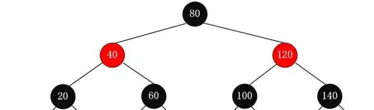
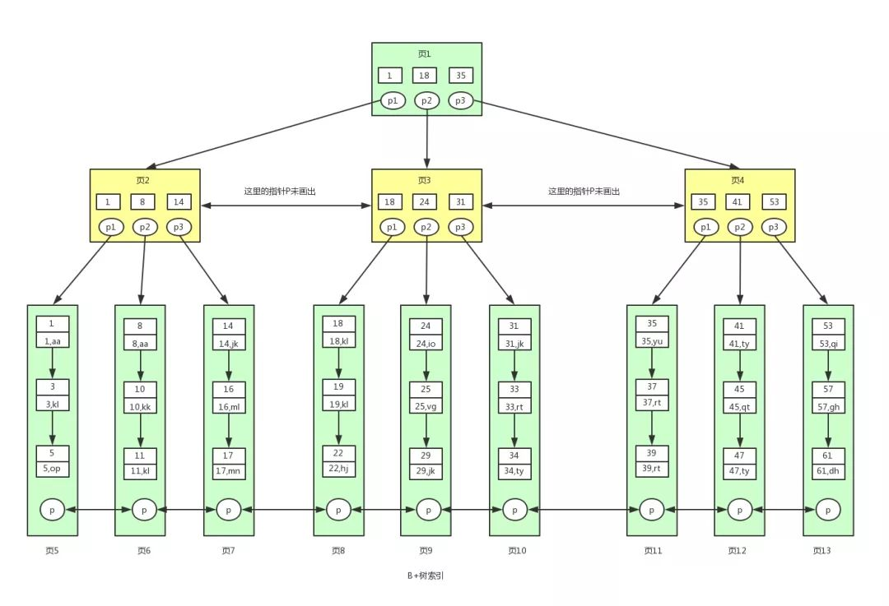

##  Mysql Tree
``` 

B+树
优点：
    多路树降低了树高度
    只有叶子节点才存放数据，
    叶子节点数据为顺序数据查找方便，
    叶子节点通过链表进行连接，
    
    因为B+树索引的所有数据均存储在叶子节点，而且数据是按照顺序排列的。那么B+树使得范围查找，排序查找，分组查找以及去重查找变得异常简单。而B树因为数据分散在各个节点，要实现这一点是很不容易的。  
   

B树
优点：多路树降低了树高度
缺点：
    每个节点都存放了data 导致单个节点存储数据大，
    数据存放在每个节点，不方便分组查找
    每个节点都有data，导致树高度仍旧高于B+树


红黑树
优点：自我平衡
缺点：树过高了，大量数据较多（查找叶子节点）成本高

```

###     红黑树
本质还是二叉树（平衡二叉树）当两边树大小不相同，会自我平衡
R-B Tree，全称是Red-Black Tree，又称为“红黑树”，它一种特殊的二叉查找树。红黑树的每个节点上都有存储位表示节点的颜色，可以是红(Red)或黑(Black)。

红黑树的特性:  （1）每个节点或者是黑色，或者是红色。  （2）根节点是黑色。  （3）每个叶子节点（NIL）是黑色。 [注意：这里叶子节点，是指为空(NIL或NULL)的叶子节点！]  （4）如果一个节点是红色的，则它的子节点必须是黑色的。  （5）从一个节点到该节点的子孙节点的所有路径上包含相同数目的黑节点。

注意：  (01) 特性(3)中的叶子节点，是只为空(NIL或null)的节点。  (02) 特性(5)，确保没有一条路径会比其他路径长出俩倍。因而，红黑树是相对是接近平衡的二叉树。

红黑树的应用比较广泛，主要是用它来存储有序的数据，它的时间复杂度是O(lgn)，效率非常之高。  例如，Java集合中的TreeSet和TreeMap，C++ STL中的set、map，以及Linux虚拟内存的管理，都是通过红黑树去实现的。

```
红黑树的时间复杂度为: O(lgn)  下面通过“数学归纳法”对红黑树的时间复杂度进行证明。

定理：一棵含有n个节点的红黑树的高度至多为2log(n+1).
```

红黑树的基本操作(一) 左旋和右旋
红黑树的基本操作是添加、删除。在对红黑树进行添加或删除之后，都会用到旋转方法。为什么呢？道理很简单，添加或删除红黑树中的节点之后，红黑树就发生了变化，可能不满足红黑树的5条性质，也就不再是一颗红黑树了，而是一颗普通的树。而通过旋转，可以使这颗树重新成为红黑树。简单点说，旋转的目的是让树保持红黑树的特性。  旋转包括两种：左旋 和 右旋。下面分别对它们进行介绍。

1. 左旋

对x进行左旋，意味着"将x变成一个左节点"。

左旋的伪代码《算法导论》：参考上面的示意图和下面的伪代码，理解“红黑树T的节点x进行左旋”是如何进行的。

``` 
LEFT-ROTATE(T, x)
y ← right[x] // 前提：这里假设x的右孩子为y。下面开始正式操作
right[x] ← left[y] // 将 “y的左孩子” 设为 “x的右孩子”，即 将β设为x的右孩子
p[left[y]] ← x // 将 “x” 设为 “y的左孩子的父亲”，即 将β的父亲设为x
p[y] ← p[x] // 将 “x的父亲” 设为 “y的父亲”
if p[x] = nil[T]
then root[T] ← y // 情况1：如果 “x的父亲” 是空节点，则将y设为根节点
else if x = left[p[x]]
then left[p[x]] ← y // 情况2：如果 x是它父节点的左孩子，则将y设为“x的父节点的左孩子”
else right[p[x]] ← y // 情况3：(x是它父节点的右孩子) 将y设为“x的父节点的右孩子”
left[y] ← x // 将 “x” 设为 “y的左孩子”
p[x] ← y // 将 “x的父节点” 设为 “y”
```
理解左旋之后，看看下面一个更鲜明的例子。你可以先不看右边的结果，自己尝试一下。

2. 右旋

对x进行左旋，意味着"将x变成一个左节点"。

右旋的伪代码《算法导论》：参考上面的示意图和下面的伪代码，理解“红黑树T的节点y进行右旋”是如何进行的。

``` 
RIGHT-ROTATE(T, y)
x ← left[y] // 前提：这里假设y的左孩子为x。下面开始正式操作
left[y] ← right[x] // 将 “x的右孩子” 设为 “y的左孩子”，即 将β设为y的左孩子
p[right[x]] ← y // 将 “y” 设为 “x的右孩子的父亲”，即 将β的父亲设为y
p[x] ← p[y] // 将 “y的父亲” 设为 “x的父亲”
if p[y] = nil[T]
then root[T] ← x // 情况1：如果 “y的父亲” 是空节点，则将x设为根节点
else if y = right[p[y]]
then right[p[y]] ← x // 情况2：如果 y是它父节点的右孩子，则将x设为“y的父节点的左孩子”
else left[p[y]] ← x // 情况3：(y是它父节点的左孩子) 将x设为“y的父节点的左孩子”
right[x] ← y // 将 “y” 设为 “x的右孩子”
p[y] ← x // 将 “y的父节点” 设为 “x”
```
理解右旋之后，看看下面一个更鲜明的例子。你可以先不看右边的结果，自己尝试一下。

旋转总结：

(01) 左旋 和 右旋 是相对的两个概念，原理类似。理解一个也就理解了另一个。

(02) 下面谈谈如何区分 左旋 和 右旋。  在实际应用中，若没有彻底理解 左旋 和 右旋，可能会将它们混淆。下面谈谈我对如何区分 左旋 和 右旋 的理解。

3. 区分 左旋 和 右旋

仔细观察上面"左旋"和"右旋"的示意图。我们能清晰的发现，它们是对称的。无论是左旋还是右旋，被旋转的树，在旋转前是二叉查找树，并且旋转之后仍然是一颗二叉查找树。

左旋示例图(以x为
``` 
y
x \
/ \ --(右旋)--> x
y z \
z

对x进行右旋，意味着，将“x的左孩子”设为“x的父亲节点”；即，将 x变成了一个右节点(x成了为y的右孩子)！ 因此，右旋中的“右”，意味着“被旋转的节点将变成一个右节点”。
```
###    B树
在红黑树基础上进行优化  
B+树每次分配是多个红黑树，通过指定多个树降低单个红黑树的树高  
从而降低查询成本

###    B+树
Mysql 每个节点分配16kB  

在B树上进行优化
B+树是B树的一种变体，有着比B树更高的查询性能。一个m阶B树具有如下特征：


B 树是一种多路查找平衡树，其命名来自英语称谓 Balance Tree，也就是平衡树的意思。

一棵 M 阶 B 树的定义为：

树中每个结点最多含有 M 棵子树，M-1 个值。
若根结点不是叶子结点，则至少有2棵子树。  
除根结点之外的所有非叶子结点至少有 [m/2]（向下取整） 棵子树。  
每个结点包含的值，值是从小到大排序，子树的大小们也都是介于这些值之间。  
可以参考 2-3 树或 2-3-4 树，红黑树章节介绍的 2-3 树和 2-3-4 树都是 B 树，一个是3阶，一个是4阶  
``` 
1、根节点至少有两个节点；

2、每个中间节点都包含k-1个元素和k个孩子，其中m/2<=k<=m；

3、每一个叶子节点都包含k-1个元素，其中m/2<=k<=m；

4、所有的叶子节点都位于同一层；

5、每个节点中的元素从小到大排列，节点当中k-1个元素正好是k个孩子包含的元素的值域划分。

B+树和B树有一些共同特征，但是B+树也具备一些新的特征：

1、有k个子树的中间节点包含有k个元素（B树中是k-1个元素），每个元素不保存数据，只用来索引，所有数据都保存在叶子节点；

2、所有的叶子节点中包含了全部元素的信息，及指向含这些元素记录的指针，且叶子节点本身依关键字的大小自小而大顺序链接；

3、所有的中间节点元素都同时存在于子节点，在子节点元素中是最大（或最小）元素。

4 非叶子节点不存data，值存储索引（冗余）可以存放更多索引
5 叶子节点存放所有索引字段
6 叶子节点通过指针链接提高访问性能

```

