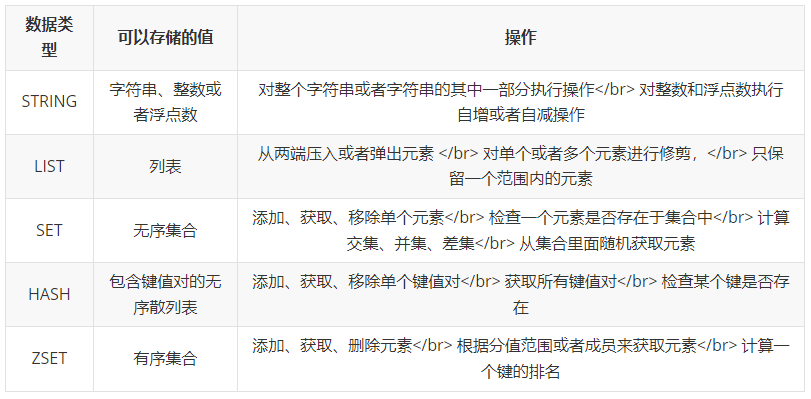
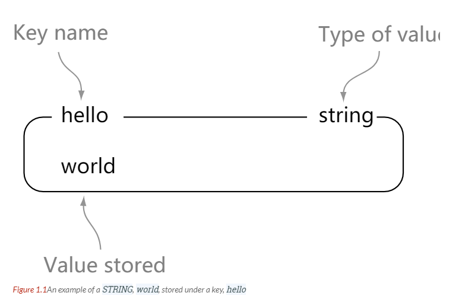
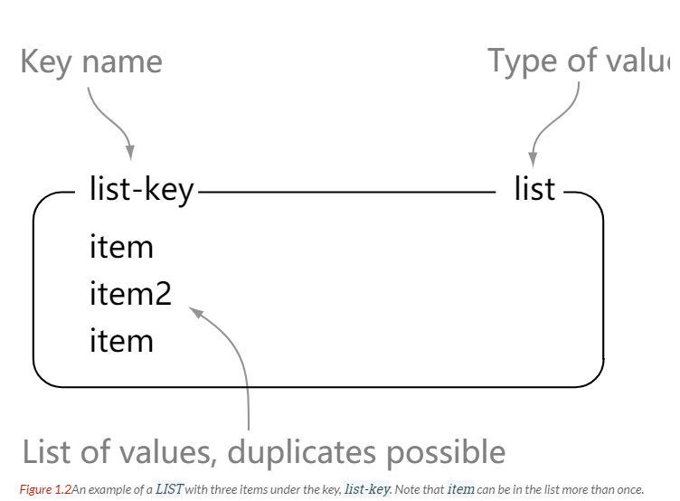
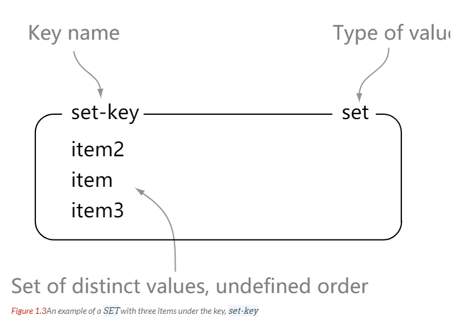
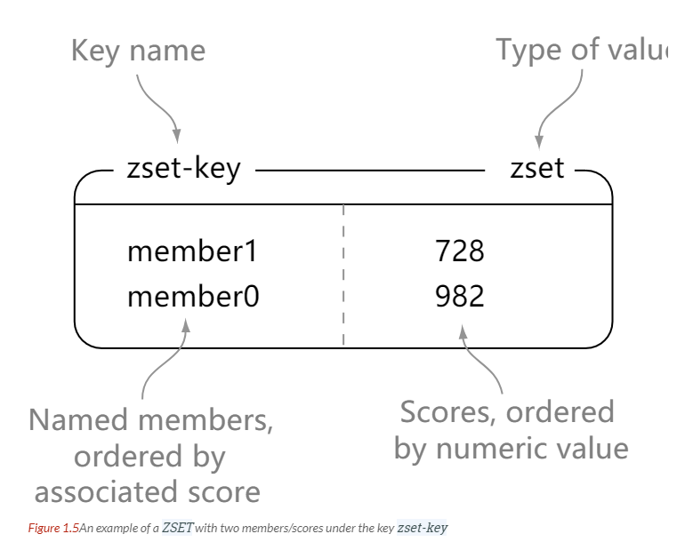
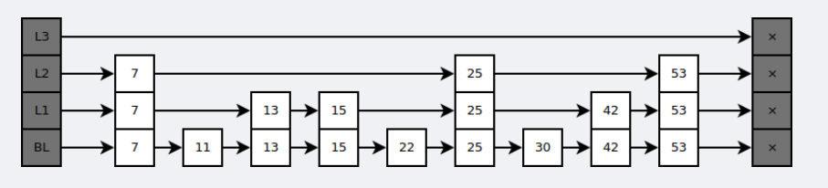
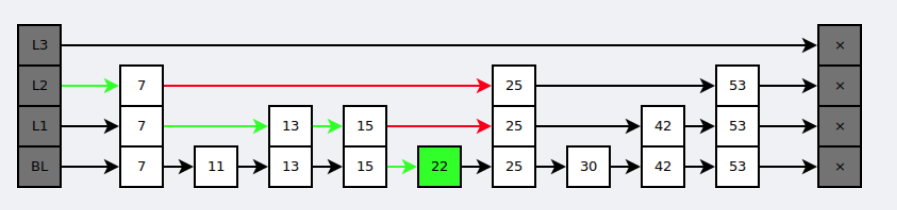

#Redis

Redis 是速度非常快的非关系型（NoSQL）内存键值数据库，可以存储键和五种不同类型的值之间的映射。  
键的类型只能为字符串，值支持五种数据类型：字符串、列表、集合、散列表、有序集合。  
Redis 支持很多特性，例如将内存中的数据持久化到硬盘中，使用复制来扩展读性能，使用分片来扩展写性能。

##数据格式


###string

###list

###set

###hash

###zset 有序集合



###数据结构

dictht 是一个散列表结构，使用拉链法解决哈希冲突。
``` 
/* This is our hash table structure. Every dictionary has two of this as we
 * implement incremental rehashing, for the old to the new table. */
typedef struct dictht {
    dictEntry **table;
    unsigned long size;
    unsigned long sizemask;
    unsigned long used;
} dictht;


typedef struct dictEntry {
    void *key;
    union {
        void *val;
        uint64_t u64;
        int64_t s64;
        double d;
    } v;
    struct dictEntry *next;
} dictEntry;
```

Redis 的字典 dict 中包含两个哈希表 dictht，这是为了方便进行 rehash 操作。在扩容时，将其中一个 dictht 上的键值对 rehash 到另一个 dictht 上面，完成之后释放空间并交换两个 dictht 的角色。

``` 
typedef struct dict {
    dictType *type;
    void *privdata;
    dictht ht[2];
    long rehashidx; /* rehashing not in progress if rehashidx == -1 */
    unsigned long iterators; /* number of iterators currently running */
} dict;
```

rehash 操作不是一次性完成，而是采用渐进方式，这是为了避免一次性执行过多的 rehash 操作给服务器带来过大的负担。

渐进式 rehash 通过记录 dict 的 rehashidx 完成，它从 0 开始，然后每执行一次 rehash 都会递增。例如在一次 rehash 中，要把 dict[0] rehash 到 dict[1]，这一次会把 dict[0] 上 table[rehashidx] 的键值对 rehash 到 dict[1] 上，dict[0] 的 table[rehashidx] 指向 null，并令 rehashidx++。

在 rehash 期间，每次对字典执行添加、删除、查找或者更新操作时，都会执行一次渐进式 rehash。

采用渐进式 rehash 会导致字典中的数据分散在两个 dictht 上，因此对字典的查找操作也需要到对应的 dictht 去执行。

###rehash 具体操作
```
/* Performs N steps of incremental rehashing. Returns 1 if there are still
 * keys to move from the old to the new hash table, otherwise 0 is returned.
 *
 * Note that a rehashing step consists in moving a bucket (that may have more
 * than one key as we use chaining) from the old to the new hash table, however
 * since part of the hash table may be composed of empty spaces, it is not
 * guaranteed that this function will rehash even a single bucket, since it
 * will visit at max N*10 empty buckets in total, otherwise the amount of
 * work it does would be unbound and the function may block for a long time. */
int dictRehash(dict *d, int n) {
    int empty_visits = n * 10; /* Max number of empty buckets to visit. */
    if (!dictIsRehashing(d)) return 0;

    while (n-- && d->ht[0].used != 0) {
        dictEntry *de, *nextde;

        /* Note that rehashidx can't overflow as we are sure there are more
         * elements because ht[0].used != 0 */
        assert(d->ht[0].size > (unsigned long) d->rehashidx);
        while (d->ht[0].table[d->rehashidx] == NULL) {
            d->rehashidx++;
            if (--empty_visits == 0) return 1;
        }
        de = d->ht[0].table[d->rehashidx];
        /* Move all the keys in this bucket from the old to the new hash HT */
        while (de) {
            uint64_t h;

            nextde = de->next;
            /* Get the index in the new hash table */
            h = dictHashKey(d, de->key) & d->ht[1].sizemask;
            de->next = d->ht[1].table[h];
            d->ht[1].table[h] = de;
            d->ht[0].used--;
            d->ht[1].used++;
            de = nextde;
        }
        d->ht[0].table[d->rehashidx] = NULL;
        d->rehashidx++;
    }

    /* Check if we already rehashed the whole table... */
    if (d->ht[0].used == 0) {
        zfree(d->ht[0].table);
        d->ht[0] = d->ht[1];
        _dictReset(&d->ht[1]);
        d->rehashidx = -1;
        return 0;
    }

    /* More to rehash... */
    return 1;
}
```
####跳表

是有序集合的底层实现之一。

跳跃表是基于多指针有序链表实现的，可以看成多个有序链表。

在查找时，从上层指针开始查找，找到对应的区间之后再到下一层去查找。下图演示了查找 22 的过程。

与红黑树等平衡树相比，跳跃表具有以下优点：

插入速度非常快速，因为不需要进行旋转等操作来维护平衡性；  
更容易实现；  
支持无锁操作。  